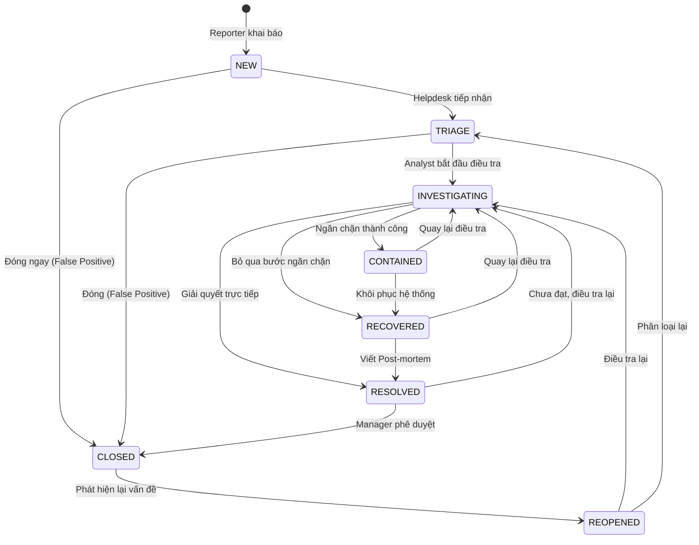
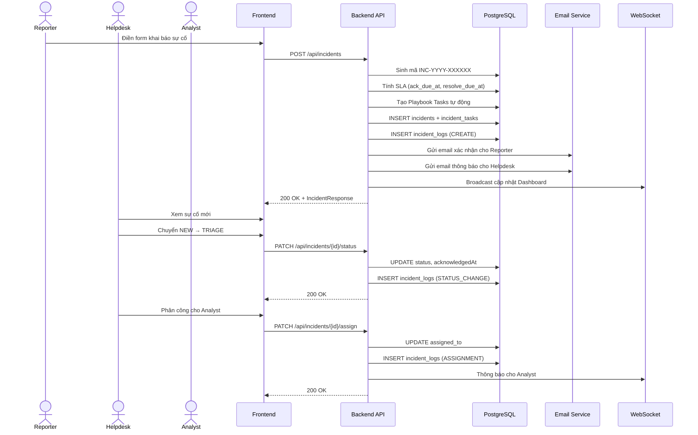
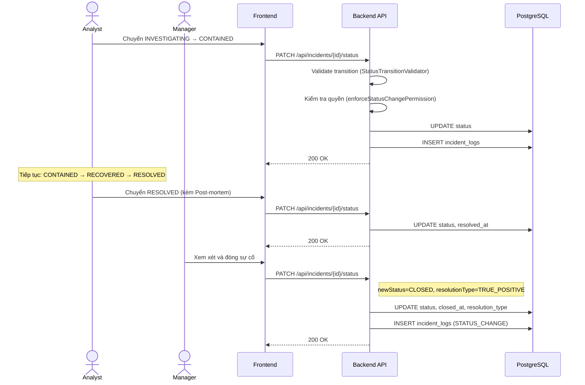
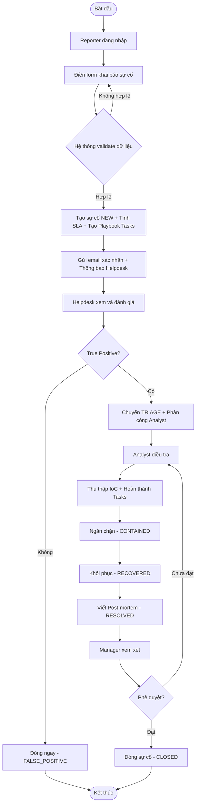
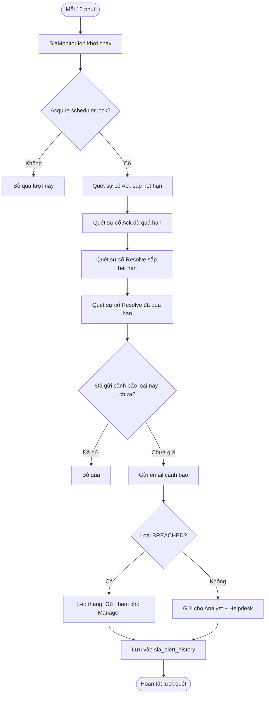
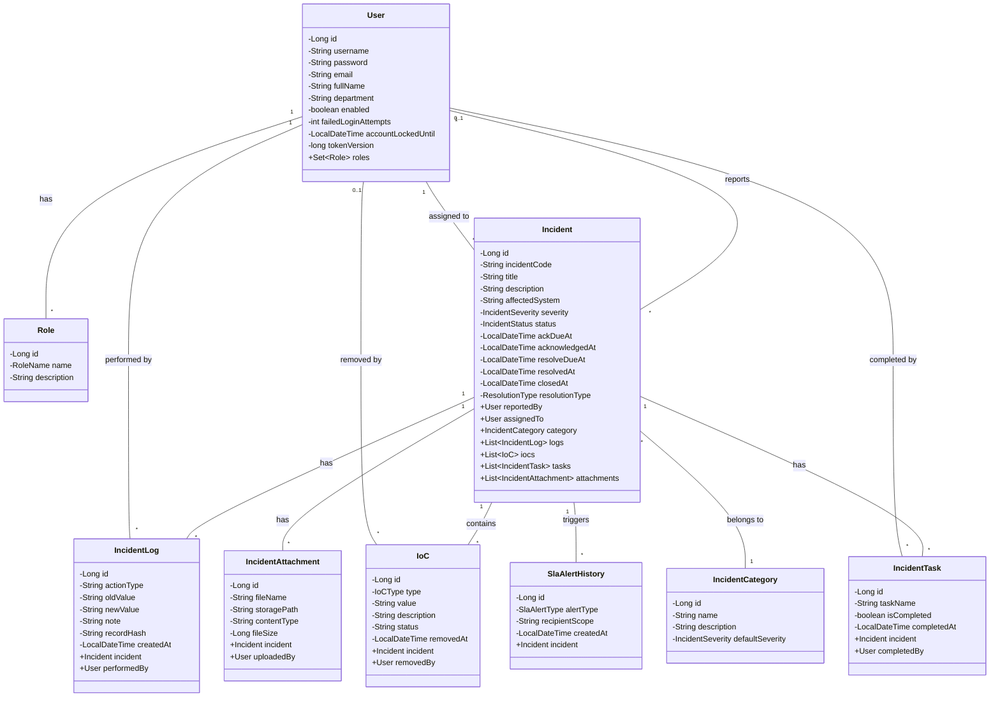
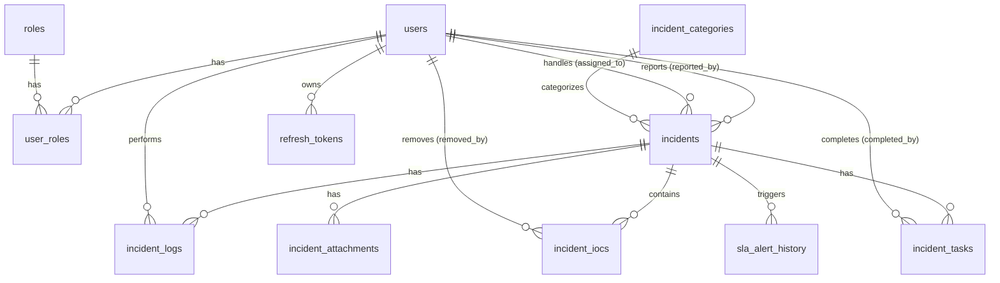

# BỘ KHOA HỌC VÀ CÔNG NGHỆ
# HỌC VIỆN CÔNG NGHỆ BƯU CHÍNH VIỄN THÔNG

---

# BÁO CÁO ĐỒ ÁN MÔN HỌC

**MÔN HỌC:** Phân tích và Thiết kế Hệ thống Thông tin<br>
**ĐỀ TÀI:** Hệ thống Quản lý Sự cố An Toàn Thông Tin chuẩn SOC (Security Operations Center)

**Giảng viên hướng dẫn:** Nguyễn Thị Bích Nguyên<br>
**Nhóm thực hiện:** Nhóm 14<br>
**Lớp môn học / Khóa:** D23CQAT01-N<br>

**Thực hiện bởi nhóm sinh viên, bao gồm:**

| STT | Họ và tên | MSSV | Lớp SV | Vai trò |
|:---:|---|:---:|:---:|:---:|
| 1 | Võ Nguyễn Nhật Nam | N23DCAT045 | D23CQAT01-N | Trưởng nhóm |
| 2 | Mai Tùng Dương | *(MSSV)* | D23CQAT01-N | Thành viên |
| 3 | Trần An Thuận | *(MSSV)* | D23CQAT01-N | Thành viên |

**TP.HCM, tháng 09/2026**

---

# MỤC LỤC

- [DANH SÁCH HÌNH, BẢNG](#danh-sách-hình-bảng)
- [DANH MỤC TỪ VIẾT TẮT](#danh-mục-từ-viết-tắt)
- [CHƯƠNG I. TỔNG QUAN](#chương-i-tổng-quan)
  - I. Giới thiệu đề tài
  - II. Mục tiêu của đề tài
  - III. Phạm vi áp dụng
  - IV. Nền tảng kỹ thuật
  - V. Cơ sở lý thuyết
- [CHƯƠNG II. PHÂN TÍCH NỘI DUNG, YÊU CẦU](#chương-ii-phân-tích-nội-dung-yêu-cầu)
  - I. Quy trình tiếp nhận và xử lý sự cố ATTT
  - II. Quy trình giám sát SLA và leo thang cảnh báo
  - III. Yêu cầu chức năng nghiệp vụ
  - IV. Yêu cầu chức năng hệ thống và yêu cầu chất lượng
- [CHƯƠNG III. PHÂN TÍCH THIẾT KẾ HỆ THỐNG](#chương-iii-phân-tích-thiết-kế-hệ-thống)
  - I. Sơ đồ Use Case
  - II. Sơ đồ trạng thái
  - III. Sơ đồ tuần tự
  - IV. Sơ đồ hoạt động
  - V. Sơ đồ lớp
  - VI. Thiết kế cơ sở dữ liệu
  - VII. Thiết kế giao diện
  - VIII. Thiết kế xử lý
- [CHƯƠNG IV. PHÁT TRIỂN / THỰC THI](#chương-iv-phát-triển--thực-thi)
- [CHƯƠNG V. TRIỂN KHAI](#chương-v-triển-khai)
- [CHƯƠNG VI. KẾT LUẬN](#chương-vi-kết-luận)
- [TÀI LIỆU THAM KHẢO](#tài-liệu-tham-khảo)

---

# DANH SÁCH HÌNH, BẢNG

| STT | Loại | Mô tả |
|---|---|---|
| Hình 3.1 | Sơ đồ | Use Case tổng quan hệ thống |
| Hình 3.2 | Sơ đồ | Trạng thái vòng đời sự cố |
| Hình 3.3 | Sơ đồ | Tuần tự — Khai báo và phân công sự cố |
| Hình 3.4 | Sơ đồ | Tuần tự — Chuyển trạng thái và đóng sự cố |
| Hình 3.5 | Sơ đồ | Hoạt động — Quy trình xử lý sự cố end-to-end |
| Hình 3.6 | Sơ đồ | Hoạt động — Giám sát SLA tự động |
| Hình 3.7 | Sơ đồ | Lớp (Class Diagram) |
| Hình 3.8 | Sơ đồ | ERD — Mô hình quan hệ thực thể |
| Hình 4.1 | Giao diện | Màn hình Đăng nhập |
| Hình 4.2 | Giao diện | Màn hình Dashboard điều hành |
| Hình 4.3 | Giao diện | Màn hình Danh sách sự cố |
| Hình 4.4 | Giao diện | Màn hình Chi tiết sự cố |
| Hình 4.5 | Giao diện | Màn hình Khai báo sự cố |
| Hình 4.6 | Giao diện | Màn hình Quản lý người dùng |
| Bảng 2.1 | Bảng | Chức năng của vai trò ADMIN |
| Bảng 2.2 | Bảng | Chức năng của vai trò MANAGER |
| Bảng 2.3 | Bảng | Chức năng của vai trò HELPDESK |
| Bảng 2.4 | Bảng | Chức năng của vai trò ANALYST |
| Bảng 2.5 | Bảng | Chức năng của vai trò REPORTER |
| Bảng 3.1 | Bảng | Cấu trúc 12 bảng dữ liệu |
| Bảng 5.1 | Bảng | Danh sách chức năng và mức độ hoàn thành |

---

# DANH MỤC TỪ VIẾT TẮT

| Viết tắt | Tiếng Anh | Ý nghĩa |
|---|---|---|
| ATTT | — | An Toàn Thông Tin |
| SOC | Security Operations Center | Trung tâm Điều hành An ninh Mạng |
| SLA | Service Level Agreement | Thỏa thuận Mức độ Dịch vụ (cam kết thời gian xử lý) |
| MTTA | Mean Time To Acknowledge | Thời gian trung bình tiếp nhận sự cố |
| MTTR | Mean Time To Resolve | Thời gian trung bình giải quyết sự cố |
| IoC | Indicator of Compromise | Chỉ số Thỏa hiệp (dấu vết kẻ tấn công) |
| RBAC | Role-Based Access Control | Kiểm soát truy cập dựa trên vai trò |
| JWT | JSON Web Token | Chuẩn xác thực không trạng thái |
| NIST | National Institute of Standards and Technology | Viện Tiêu chuẩn và Công nghệ Quốc gia Hoa Kỳ |
| SANS | SysAdmin, Audit, Network, Security | Tổ chức đào tạo An ninh mạng quốc tế |
| ERD | Entity Relationship Diagram | Sơ đồ quan hệ thực thể |
| API | Application Programming Interface | Giao diện lập trình ứng dụng |
| REST | Representational State Transfer | Kiến trúc API tiêu chuẩn web |
| CRUD | Create, Read, Update, Delete | Các thao tác cơ bản trên dữ liệu |

---

# CHƯƠNG I. TỔNG QUAN

## I. Giới thiệu đề tài

Trong bối cảnh các cuộc tấn công mạng ngày càng gia tăng về cả số lượng và mức độ tinh vi, việc quản lý sự cố an toàn thông tin (ATTT) một cách hệ thống, có quy trình là yêu cầu bắt buộc đối với mọi tổ chức. Các sự cố như Ransomware mã hóa dữ liệu, rò rỉ thông tin khách hàng, tấn công phishing nhắm vào nhân viên nội bộ đòi hỏi phải có một hệ thống tiếp nhận, phân loại, điều tra và khắc phục sự cố chuyên nghiệp.

Đề tài **"Hệ thống Quản lý Sự cố An Toàn Thông Tin chuẩn SOC"** xây dựng một nền tảng web toàn diện, mô phỏng quy trình vận hành của một Trung tâm Điều hành An ninh (Security Operations Center — SOC) thực tế, cho phép:

- **Tiếp nhận sự cố** từ nhân viên hoặc hệ thống giám sát tự động
- **Phân loại và phân công** sự cố đến chuyên viên phân tích phù hợp
- **Điều tra, thu thập chứng cứ** (IoC tracking, playbook tasks)
- **Theo dõi SLA** (thời gian cam kết xử lý) với cảnh báo tự động qua email
- **Đóng sự cố** với kết luận phân loại (True Positive / False Positive)
- **Kiểm toán bất biến** — mọi thao tác được ghi log và bảo vệ bằng chuỗi hash

## II. Mục tiêu của đề tài

1. Xây dựng hệ thống quản lý vòng đời sự cố ATTT theo tiêu chuẩn NIST SP 800-61 và SANS Incident Response Framework
2. Cung cấp Dashboard điều hành thời gian thực cho đội SOC
3. Tự động tính toán và giám sát SLA theo mức độ nghiêm trọng
4. Triển khai hệ thống kiểm toán bất biến (tamper-evident audit trail) chống sửa đổi dữ liệu
5. Hỗ trợ phân quyền RBAC 5 cấp phù hợp mô hình SOC thực tế
6. Mã hóa dữ liệu nhạy cảm (AES-GCM 256-bit) trong cơ sở dữ liệu

## III. Phạm vi áp dụng

- **Đối tượng sử dụng:** Đội ngũ SOC bao gồm Quản trị viên (Admin), Quản lý (Manager), Cán bộ tiếp nhận (Helpdesk), Chuyên viên phân tích (Analyst), Người dùng cuối khai báo sự cố (Reporter)
- **Quy mô:** Hệ thống web nội bộ doanh nghiệp, có thể mở rộng thành SaaS
- **Môi trường triển khai:** Docker container, hỗ trợ cả môi trường development và production

## IV. Nền tảng kỹ thuật

### Backend
| Công nghệ | Phiên bản | Vai trò |
|---|---|---|
| Java | 17 | Ngôn ngữ lập trình chính |
| Spring Boot | 3.3.2 | Framework backend |
| Spring Security | — | Xác thực JWT + phân quyền RBAC |
| Spring Data JPA | — | ORM truy vấn cơ sở dữ liệu |
| Spring WebSocket | — | Cập nhật real-time |
| PostgreSQL | 16 | Hệ quản trị CSDL quan hệ |
| Flyway | — | Migration cơ sở dữ liệu tự động |
| Apache POI | 5.2.5 | Xuất file Excel (.xlsx) |
| OpenPDF | 1.3.36 | Xuất file PDF |

### Frontend
| Công nghệ | Phiên bản | Vai trò |
|---|---|---|
| React | — | Thư viện UI |
| TypeScript | — | Ngôn ngữ lập trình frontend |
| Vite | — | Build tool nhanh |
| Ant Design | v6 | Thư viện component UI |
| Recharts | — | Biểu đồ tương tác |

### DevOps
| Công nghệ | Vai trò |
|---|---|
| Docker + Docker Compose | Container hóa và triển khai |
| pgAdmin | Quản trị cơ sở dữ liệu |

## V. Cơ sở lý thuyết

### 1. Quy trình ứng phó sự cố theo NIST SP 800-61

NIST SP 800-61 (Computer Security Incident Handling Guide) định nghĩa 4 giai đoạn ứng phó sự cố:

1. **Preparation** (Chuẩn bị): Xây dựng đội SOC, playbook, công cụ giám sát
2. **Detection & Analysis** (Phát hiện & Phân tích): Tiếp nhận cảnh báo, xác nhận True/False Positive
3. **Containment, Eradication & Recovery** (Ngăn chặn, Loại trừ & Khôi phục): Cô lập hệ thống bị ảnh hưởng, diệt mã độc, khôi phục dịch vụ
4. **Post-Incident Activity** (Hoạt động sau sự cố): Viết báo cáo post-mortem, rút bài học kinh nghiệm

Hệ thống ánh xạ 4 giai đoạn này thành 8 trạng thái: `NEW → TRIAGE → INVESTIGATING → CONTAINED → RECOVERED → RESOLVED → CLOSED` (+ `REOPENED`).

### 2. SLA (Service Level Agreement) trong SOC

SLA quy định thời gian tối đa mà đội SOC cam kết xử lý sự cố. Hệ thống áp dụng 2 chỉ số:

- **MTTA (Mean Time To Acknowledge):** Thời gian tối đa từ khi sự cố được tạo đến khi Helpdesk tiếp nhận
- **MTTR (Mean Time To Resolve):** Thời gian tối đa từ khi tạo đến khi giải quyết xong

Công thức tính SLA trong hệ thống:
```
Resolve SLA = SLA_HOURS[severity]    // CRITICAL=4h, HIGH=24h, MEDIUM=48h, LOW=72h
Ack SLA     = max(1, Resolve ÷ 4)   // CRITICAL=1h, HIGH=6h, MEDIUM=12h, LOW=18h
```

### 3. IoC (Indicator of Compromise) — Chỉ số Thỏa hiệp

IoC là các dấu hiệu kỹ thuật cho thấy hệ thống đã bị xâm nhập. Hệ thống hỗ trợ 7 loại IoC: IPv4, Domain, URL, MD5 Hash, SHA256 Hash, Email Address, File Path.

### 4. RBAC (Role-Based Access Control) — Kiểm soát truy cập dựa trên vai trò

Hệ thống phân quyền theo mô hình SOC tiered:
- **Tier 0 (Reporter):** Người dùng cuối khai báo sự cố
- **Tier 1 (Helpdesk):** Cán bộ tiếp nhận, phân loại sơ bộ, phân công
- **Tier 2 (Analyst):** Chuyên viên phân tích, điều tra, xử lý kỹ thuật
- **Manager:** Quản lý, phê duyệt, đóng sự cố
- **Admin:** Quản trị toàn hệ thống

### 5. Kiểm toán bất biến (Tamper-evident Audit Trail)

Mỗi hành động trên sự cố đều tạo bản ghi log dạng append-only, kèm hash SHA-256 liên kết. Điều này đảm bảo nếu bất kỳ bản ghi nào bị sửa đổi, chuỗi hash sẽ bị phá vỡ → phát hiện giả mạo dữ liệu.

---

# CHƯƠNG II. PHÂN TÍCH NỘI DUNG, YÊU CẦU

## I. Quy trình tiếp nhận và xử lý sự cố ATTT

### 1. Mô tả quy trình

Quy trình xử lý sự cố ATTT tuân theo luồng trạng thái nghiêm ngặt, đảm bảo mọi sự cố đều được xử lý đúng trình tự:

```
NEW → TRIAGE → INVESTIGATING → CONTAINED → RECOVERED → RESOLVED → CLOSED
                                                                      ↓
                                    TRIAGE / INVESTIGATING ← REOPENED ←
```

### 2. Chi tiết từng bước

| Bước | Trạng thái | Người thực hiện | Mô tả |
|---|---|---|---|
| 1 | **NEW** | Reporter | Nhân viên phát hiện sự cố → Đăng nhập hệ thống → Điền form khai báo (tiêu đề, mô tả, loại, mức độ, hệ thống ảnh hưởng) |
| 2 | **TRIAGE** | Helpdesk | Tiếp nhận sự cố → Xác nhận True/False Positive → Phân công cho Analyst phù hợp |
| 3 | **INVESTIGATING** | Analyst | Điều tra nguyên nhân → Thu thập IoC (IP, hash, domain) → Thực hiện playbook tasks |
| 4 | **CONTAINED** | Analyst | Ngăn chặn sự cố lan rộng (block IP, cô lập máy tính, vô hiệu hóa tài khoản) |
| 5 | **RECOVERED** | Analyst | Khôi phục hệ thống bị ảnh hưởng (restore backup, cài lại OS, cấp lại credentials) |
| 6 | **RESOLVED** | Analyst | Viết báo cáo Post-mortem → Upload chứng cứ đính kèm → Đề xuất cải thiện |
| 7 | **CLOSED** | Manager | Xem xét toàn bộ log, IoC, tasks → Đánh giá Resolution Type → Phê duyệt đóng sự cố |

### 3. Tự động hóa khi tạo sự cố

Khi sự cố được khai báo, hệ thống tự động thực hiện:
- Sinh mã sự cố duy nhất: `INC-{năm}-{số tự tăng 6 chữ số}` (VD: `INC-2026-000042`)
- Tính SLA Ack và SLA Resolve dựa trên mức độ nghiêm trọng
- Tạo Playbook Tasks tự động dựa trên loại sự cố (Phishing, Mã độc, Rò rỉ dữ liệu, Truy cập trái phép)
- Gửi email xác nhận cho người báo cáo
- Gửi email thông báo cho đội Helpdesk
- Cập nhật Dashboard real-time qua WebSocket

## II. Quy trình giám sát SLA và leo thang cảnh báo

### 1. Mô tả quy trình

Hệ thống chạy một tác vụ nền (`SlaMonitorJob`) **quét mỗi 15 phút**, kiểm tra tất cả sự cố đang mở:

### 2. Chi tiết thời gian cảnh báo theo mức độ

**CRITICAL (Mức nghiêm trọng nhất):**

| Cảnh báo | Thời hạn | Gửi email lúc | Người nhận |
|---|---|---|---|
| ACK_WARNING | T + 1h | Ngay khi phát hiện | Analyst + Helpdesk |
| ACK_BREACHED | T + 1h | T + 1h | Analyst + Helpdesk + **Manager** |
| RESOLVE_WARNING | T + 4h | T + 2h | Analyst |
| RESOLVE_BREACHED | T + 4h | T + 4h | Analyst + **Manager** |

**HIGH:**

| Cảnh báo | Thời hạn | Gửi email lúc | Người nhận |
|---|---|---|---|
| ACK_WARNING | T + 6h | T + 4h | Analyst + Helpdesk |
| ACK_BREACHED | T + 6h | T + 6h | Analyst + Helpdesk + **Manager** |
| RESOLVE_WARNING | T + 24h | T + 22h | Analyst |
| RESOLVE_BREACHED | T + 24h | T + 24h | Analyst + **Manager** |

**MEDIUM:**

| Cảnh báo | Thời hạn | Gửi email lúc | Người nhận |
|---|---|---|---|
| ACK_WARNING | T + 12h | T + 10h | Analyst + Helpdesk |
| ACK_BREACHED | T + 12h | T + 12h | Analyst + Helpdesk + **Manager** |
| RESOLVE_WARNING | T + 48h | T + 46h | Analyst |
| RESOLVE_BREACHED | T + 48h | T + 48h | Analyst + **Manager** |

**LOW:**

| Cảnh báo | Thời hạn | Gửi email lúc | Người nhận |
|---|---|---|---|
| ACK_WARNING | T + 18h | T + 16h | Analyst + Helpdesk |
| ACK_BREACHED | T + 18h | T + 18h | Analyst + Helpdesk + **Manager** |
| RESOLVE_WARNING | T + 72h | T + 70h | Analyst |
| RESOLVE_BREACHED | T + 72h | T + 72h | Analyst + **Manager** |

### 3. Cơ chế chống spam

Bảng `sla_alert_history` với ràng buộc `UNIQUE(incident_id, alert_type, recipient_key)` ghi nhận từng người nhận đã nhận thành công. Nhờ đó hệ thống không gửi lặp cho người đã nhận nhưng vẫn có thể thử lại riêng người nhận bị lỗi SMTP.

## III. Yêu cầu chức năng nghiệp vụ

### Bảng 2.1 — Chức năng của vai trò ADMIN (Quản trị viên hệ thống)

| STT | Công việc | Loại | Quy định / Công thức liên quan | Ghi chú |
|---|---|---|---|---|
| 1 | Đăng nhập | Tra cứu | Bắt buộc có tài khoản; Email/username + mật khẩu; Khóa IP sau 5 lần sai liên tiếp | |
| 2 | Đăng xuất | Xử lý | Thu hồi Refresh Token; Xóa cookie xác thực | |
| 3 | Tạo tài khoản người dùng | Lưu trữ | Username và email duy nhất; Mật khẩu 12-72 ký tự (chứa hoa, thường, số, đặc biệt); Gán 1+ vai trò | |
| 4 | Xem danh sách người dùng | Trích xuất | Hỗ trợ phân trang, tìm kiếm theo tên/email | |
| 5 | Cập nhật thông tin người dùng | Cập nhật | Sửa tên, email, phòng ban, vai trò | |
| 6 | Vô hiệu hóa / Kích hoạt tài khoản | Cập nhật | Không được tự vô hiệu hóa chính mình | Soft delete |
| 7 | Buộc đổi mật khẩu người dùng | Cập nhật | Mật khẩu mới phải tuân thủ chính sách bảo mật | |
| 8 | Mở khóa tài khoản bị khóa | Cập nhật | Reset `failed_login_attempts` về 0; Xóa `account_locked_until` | |
| 9 | Thu hồi phiên đăng nhập (Revoke All Sessions) | Xử lý | Tăng `token_version` → toàn bộ JWT cũ hết hiệu lực | |
| 10 | Xem / Chuyển trạng thái bất kỳ sự cố | Toàn quyền | Không bị ràng buộc phân quyền trạng thái | |
| 11 | Phân công sự cố cho Analyst | Xử lý | Chỉ phân công cho tài khoản ANALYST đang hoạt động | |
| 12 | Xem Dashboard thống kê | Trích xuất | Tổng sự cố, phân bổ severity/status, SLA compliance rate | |
| 13 | Xuất báo cáo Excel / PDF | Trích xuất | Toàn bộ danh sách sự cố | |

### Bảng 2.2 — Chức năng của vai trò MANAGER (Quản lý / Trưởng nhóm ATTT)

| STT | Công việc | Loại | Quy định / Công thức liên quan | Ghi chú |
|---|---|---|---|---|
| 1 | Đăng nhập / Đăng xuất | Tra cứu / Xử lý | Như ADMIN | |
| 2 | Xem tất cả sự cố | Trích xuất | Không bị giới hạn phạm vi | |
| 3 | Phân công sự cố | Xử lý | Phân công cho Analyst bất kỳ, ở bất kỳ trạng thái nào | |
| 4 | Chuyển trạng thái bất kỳ | Cập nhật | Toàn quyền chuyển trạng thái (giống ADMIN) | |
| 5 | Đóng sự cố (CLOSED) | Cập nhật | Bắt buộc chọn `resolutionType` (TRUE_POSITIVE / FALSE_POSITIVE / BENIGN / NOT_APPLICABLE); Bắt buộc nhập ghi chú | Phê duyệt |
| 6 | Tái mở sự cố (REOPENED) | Cập nhật | Bắt buộc nhập ghi chú lý do; Hệ thống reset `closedAt`, `resolvedAt`, `resolutionType` | |
| 7 | Xem Dashboard thống kê | Trích xuất | SLA Compliance Rate, Resolution Breakdown, MTTR theo severity | |
| 8 | Xuất báo cáo Excel / PDF | Trích xuất | Toàn bộ danh sách sự cố | |
| 9 | Xem Audit Log toàn bộ | Trích xuất | Timeline mọi thao tác trên sự cố | |
| 10 | Nhận email leo thang SLA | Tự động | Khi sự cố ACK_BREACHED hoặc RESOLVE_BREACHED | |

### Bảng 2.3 — Chức năng của vai trò HELPDESK (Cán bộ tiếp nhận sự cố)

| STT | Công việc | Loại | Quy định / Công thức liên quan | Ghi chú |
|---|---|---|---|---|
| 1 | Đăng nhập / Đăng xuất | Tra cứu / Xử lý | Như trên | |
| 2 | Xem tất cả sự cố | Trích xuất | Xem được mọi sự cố (không bị giới hạn) | Tier 1 |
| 3 | Tiếp nhận sự cố (NEW → TRIAGE) | Cập nhật | Chỉ được chuyển từ NEW sang TRIAGE; Hệ thống ghi nhận `acknowledgedAt` | SLA Ack |
| 4 | Phân công sự cố | Xử lý | Chỉ phân công sự cố ở trạng thái NEW hoặc TRIAGE; Chỉ phân công cho tài khoản ANALYST đang hoạt động | |
| 5 | Nhận email thông báo sự cố mới | Tự động | Khi có sự cố mới được khai báo | |
| 6 | Nhận email cảnh báo SLA Ack | Tự động | Khi sự cố sắp/đã quá hạn tiếp nhận | |
| 7 | Không được chuyển trạng thái khác | Hạn chế | HELPDESK chỉ có quyền: NEW → TRIAGE | |

### Bảng 2.4 — Chức năng của vai trò ANALYST (Chuyên viên phân tích sự cố)

| STT | Công việc | Loại | Quy định / Công thức liên quan | Ghi chú |
|---|---|---|---|---|
| 1 | Đăng nhập / Đăng xuất | Tra cứu / Xử lý | Như trên | |
| 2 | Xem sự cố được gán cho mình | Trích xuất | Chỉ xem được sự cố mà `assigned_to = user.id` | Phân quyền |
| 3 | Chuyển trạng thái sự cố | Cập nhật | Chỉ cho sự cố mình được gán; Tuân thủ luồng trạng thái hợp lệ | |
| 4 | Bắt đầu điều tra (TRIAGE → INVESTIGATING) | Cập nhật | Ghi nhận `acknowledgedAt` nếu chưa có | |
| 5 | Ngăn chặn (INVESTIGATING → CONTAINED) | Cập nhật | Bắt buộc ghi chú biện pháp ngăn chặn | |
| 6 | Khôi phục (CONTAINED → RECOVERED) | Cập nhật | Ghi nhận các hành động khôi phục | |
| 7 | Giải quyết (RECOVERED → RESOLVED) | Cập nhật | Bắt buộc nhập ghi chú Post-mortem | |
| 8 | Thêm IoC (Indicator of Compromise) | Lưu trữ | Chọn loại (IPV4, DOMAIN, SHA256_HASH, ...); Nhập giá trị + mô tả | |
| 9 | Xóa IoC | Cập nhật | Soft delete: chuyển status ACTIVE → REMOVED; Ghi `removed_by` và `removed_at` | Bảo toàn chứng cứ |
| 10 | Thêm Task (nhiệm vụ ứng phó) | Lưu trữ | Tạo nhiệm vụ con cho sự cố | |
| 11 | Đánh dấu hoàn thành / bỏ hoàn thành Task | Cập nhật | Toggle trạng thái; Ghi `completed_by` và `completed_at` | |
| 12 | Thêm bình luận (Comment) | Lưu trữ | Ghi nhận tiến trình điều tra; Lưu dạng audit log | |
| 13 | Upload tệp đính kèm | Lưu trữ | Hỗ trợ nhiều định dạng; Giới hạn dung lượng | Chứng cứ |
| 14 | Cập nhật thông tin sự cố | Cập nhật | Sửa tiêu đề, mô tả (chỉ sự cố mình xử lý) | |
| 15 | Nhận thông báo assignment real-time | Tự động | WebSocket push khi được gán sự cố mới | |
| 16 | Nhận email cảnh báo SLA | Tự động | Warning + Breached cho sự cố mình xử lý | |

### Bảng 2.5 — Chức năng của vai trò REPORTER (Người khai báo sự cố)

| STT | Công việc | Loại | Quy định / Công thức liên quan | Ghi chú |
|---|---|---|---|---|
| 1 | Đăng nhập / Đăng xuất | Tra cứu / Xử lý | Như trên | |
| 2 | Khai báo sự cố mới | Lưu trữ | Bắt buộc: Tiêu đề, Loại sự cố, Hệ thống ảnh hưởng; Tùy chọn: Mô tả, Mức độ, Thời điểm phát hiện | |
| 3 | Xem sự cố mình đã khai báo | Trích xuất | Chỉ xem được sự cố mà `reported_by = user.id` | Phân quyền |
| 4 | Nhận email xác nhận | Tự động | Sau khi khai báo sự cố thành công | |
| 5 | Đổi mật khẩu cá nhân | Cập nhật | Mật khẩu mới tuân thủ chính sách bảo mật | |
| 6 | Không được chuyển trạng thái | Hạn chế | Reporter không có quyền xử lý sự cố | |
| 7 | Không được phân công | Hạn chế | Reporter không có quyền phân công | |

## IV. Yêu cầu chức năng hệ thống và yêu cầu chất lượng

### 1. Yêu cầu chức năng hệ thống

| STT | Yêu cầu | Mô tả |
|---|---|---|
| 1 | Xác thực JWT | Access Token (15 phút) + Refresh Token (7 ngày, lưu HttpOnly Cookie) |
| 2 | Xoay vòng Refresh Token | Mỗi lần refresh → sinh token mới, thu hồi token cũ (Rotation) |
| 3 | Chống brute-force | Khóa tài khoản sau 5 lần đăng nhập sai; Khóa IP sau 10 lần sai |
| 4 | Phân quyền RBAC | Middleware kiểm tra vai trò trước mỗi API endpoint |
| 5 | WebSocket real-time | Cập nhật Dashboard và thông báo assignment tức thì |
| 6 | Mã hóa dữ liệu nhạy cảm | Description sự cố mã hóa AES-GCM 256-bit khi lưu DB |
| 7 | Migration tự động | Flyway quản lý version CSDL, rollback an toàn |
| 8 | Email notification | Gửi thông báo qua SMTP cho các sự kiện quan trọng |

### 2. Yêu cầu chất lượng

| STT | Tiêu chí | Mô tả |
|---|---|---|
| 1 | **Hiệu năng** | API response < 500ms; Dashboard load < 2 giây |
| 2 | **Bảo mật** | Không lộ thông tin lỗi xác thực (generic error message); CORS whitelist |
| 3 | **Khả dụng** | Hỗ trợ container hóa Docker; Health check endpoint (`/actuator/health`) |
| 4 | **Khả mở rộng** | Kiến trúc tách biệt Backend/Frontend; RESTful API chuẩn |
| 5 | **Tính toàn vẹn** | Audit log append-only với hash chain chống giả mạo |
| 6 | **Giao diện** | Dark mode chuẩn SOC; Responsive; Glassmorphism design |

---

# CHƯƠNG III. PHÂN TÍCH THIẾT KẾ HỆ THỐNG

## I. Sơ đồ Use Case

```mermaid
graph TB
    subgraph "Hệ thống Quản lý Sự cố ATTT"
        UC1["Đăng nhập / Đăng xuất"]
        UC2["Khai báo sự cố"]
        UC3["Xem danh sách sự cố"]
        UC4["Xem chi tiết sự cố"]
        UC5["Tiếp nhận sự cố (NEW→TRIAGE)"]
        UC6["Phân công sự cố"]
        UC7["Chuyển trạng thái sự cố"]
        UC8["Thêm / Xóa IoC"]
        UC9["Thêm / Hoàn thành Task"]
        UC10["Thêm bình luận"]
        UC11["Upload tệp đính kèm"]
        UC12["Đóng sự cố (CLOSED)"]
        UC13["Tái mở sự cố (REOPENED)"]
        UC14["Xem Dashboard"]
        UC15["Xuất báo cáo Excel/PDF"]
        UC16["Quản lý người dùng"]
        UC17["Giám sát SLA tự động"]
    end

    REPORTER((Reporter))
    HELPDESK((Helpdesk))
    ANALYST((Analyst))
    MANAGER((Manager))
    ADMIN((Admin))
    SYSTEM((Hệ thống))

    REPORTER --> UC1
    REPORTER --> UC2
    REPORTER --> UC3
    REPORTER --> UC4

    HELPDESK --> UC1
    HELPDESK --> UC3
    HELPDESK --> UC4
    HELPDESK --> UC5
    HELPDESK --> UC6

    ANALYST --> UC1
    ANALYST --> UC3
    ANALYST --> UC4
    ANALYST --> UC7
    ANALYST --> UC8
    ANALYST --> UC9
    ANALYST --> UC10
    ANALYST --> UC11

    MANAGER --> UC1
    MANAGER --> UC3
    MANAGER --> UC4
    MANAGER --> UC6
    MANAGER --> UC7
    MANAGER --> UC12
    MANAGER --> UC13
    MANAGER --> UC14
    MANAGER --> UC15

    ADMIN --> UC1
    ADMIN --> UC16
    ADMIN --> UC14
    ADMIN --> UC15
    ADMIN --> UC7
    ADMIN --> UC6

    SYSTEM --> UC17
```



## II. Sơ đồ trạng thái

*(Hình 3.2 — Sơ đồ trạng thái vòng đời sự cố)*



## III. Sơ đồ tuần tự

### Sơ đồ 3.3 — Khai báo và phân công sự cố



### Sơ đồ 3.4 — Chuyển trạng thái và đóng sự cố



## IV. Sơ đồ hoạt động

### Sơ đồ 3.5 — Quy trình xử lý sự cố end-to-end



### Sơ đồ 3.6 — Giám sát SLA tự động



## V. Sơ đồ lớp



## VI. Thiết kế cơ sở dữ liệu

### 1. Mô hình ERD

*(Hình 3.8 — Sơ đồ ERD)*



### 2. Cấu trúc các bảng

#### Bảng `users` — Người dùng

| Cột | Kiểu | Ràng buộc | Mô tả |
|---|---|---|---|
| id | BIGINT | PK, Auto-increment | Khóa chính |
| username | VARCHAR(100) | NOT NULL, UNIQUE | Tên đăng nhập |
| password | VARCHAR(255) | NOT NULL | Mật khẩu đã hash (BCrypt) |
| email | VARCHAR(150) | NOT NULL, UNIQUE | Email |
| full_name | VARCHAR(150) | | Họ tên đầy đủ |
| department | VARCHAR(100) | | Phòng ban |
| enabled | BOOLEAN | NOT NULL, DEFAULT true | Trạng thái tài khoản |
| failed_login_attempts | INT | NOT NULL, DEFAULT 0 | Số lần đăng nhập sai liên tiếp |
| account_locked_until | TIMESTAMP | | Thời điểm hết khóa tài khoản |
| token_version | BIGINT | NOT NULL, DEFAULT 0 | Version thu hồi token |
| password_changed_at | TIMESTAMP | | Lần đổi mật khẩu gần nhất |
| created_at | TIMESTAMP | NOT NULL, DEFAULT now() | Ngày tạo |
| updated_at | TIMESTAMP | | Ngày cập nhật |

#### Bảng `roles` — Vai trò

| Cột | Kiểu | Ràng buộc | Mô tả |
|---|---|---|---|
| id | BIGINT | PK, Auto-increment | Khóa chính |
| name | VARCHAR(30) | NOT NULL, UNIQUE | ADMIN / MANAGER / HELPDESK / ANALYST / REPORTER |
| description | VARCHAR(255) | | Mô tả vai trò |

#### Bảng `user_roles` — Liên kết User-Role (N:N)

| Cột | Kiểu | Ràng buộc | Mô tả |
|---|---|---|---|
| user_id | BIGINT | PK, FK → users.id (CASCADE) | Người dùng |
| role_id | BIGINT | PK, FK → roles.id (CASCADE) | Vai trò |

#### Bảng `incident_categories` — Loại sự cố

| Cột | Kiểu | Ràng buộc | Mô tả |
|---|---|---|---|
| id | BIGINT | PK, Auto-increment | Khóa chính |
| name | VARCHAR(100) | NOT NULL, UNIQUE | Tên loại: Mã độc, Phishing, Rò rỉ dữ liệu, ... |
| description | VARCHAR(500) | | Mô tả |
| default_severity | VARCHAR(20) | | Mức độ mặc định gợi ý khi chọn loại này |

#### Bảng `incidents` — Sự cố ATTT (Bảng trung tâm)

| Cột | Kiểu | Ràng buộc | Mô tả |
|---|---|---|---|
| id | BIGINT | PK, Auto-increment | Khóa chính |
| incident_code | VARCHAR(30) | NOT NULL, UNIQUE | Mã hiển thị: INC-2026-000001 |
| title | VARCHAR(255) | NOT NULL | Tiêu đề sự cố |
| description | TEXT | | Mô tả chi tiết (mã hóa AES-GCM khi lưu DB) |
| affected_system | VARCHAR(255) | | Hệ thống bị ảnh hưởng |
| category_id | BIGINT | FK → incident_categories.id | Loại sự cố |
| severity | ENUM | NOT NULL | LOW / MEDIUM / HIGH / CRITICAL |
| status | ENUM | NOT NULL, DEFAULT 'NEW' | 8 trạng thái vòng đời |
| reported_by | BIGINT | FK → users.id | Người báo cáo |
| assigned_to | BIGINT | FK → users.id | Người được gán xử lý |
| detected_at | TIMESTAMP | | Thời điểm phát hiện sự cố |
| ack_due_at | TIMESTAMP | | Deadline tiếp nhận (SLA Ack) |
| acknowledged_at | TIMESTAMP | | Thời điểm thực tế tiếp nhận |
| resolve_due_at | TIMESTAMP | | Deadline giải quyết (SLA Resolve) |
| resolved_at | TIMESTAMP | | Thời điểm giải quyết thực tế |
| closed_at | TIMESTAMP | | Thời điểm đóng sự cố |
| resolution_type | ENUM | | TRUE_POSITIVE / FALSE_POSITIVE / BENIGN / NOT_APPLICABLE |
| sla_warning_sent | BOOLEAN | NOT NULL, DEFAULT false | Đã gửi SLA warning chưa |
| created_at | TIMESTAMP | NOT NULL, DEFAULT now() | Ngày tạo |
| updated_at | TIMESTAMP | | Ngày cập nhật |

#### Bảng `incident_logs` — Nhật ký kiểm toán

| Cột | Kiểu | Ràng buộc | Mô tả |
|---|---|---|---|
| id | BIGINT | PK, Auto-increment | Khóa chính |
| incident_id | BIGINT | NOT NULL, FK → incidents.id (CASCADE) | Sự cố |
| performed_by | BIGINT | NOT NULL, FK → users.id | Người thực hiện |
| action_type | VARCHAR(50) | NOT NULL | CREATE / STATUS_CHANGE / ASSIGNMENT / COMMENT / ADD_IOC / ... |
| old_value | VARCHAR(255) | | Giá trị cũ |
| new_value | VARCHAR(255) | | Giá trị mới |
| note | TEXT | | Ghi chú |
| record_hash | VARCHAR(128) | | Hash SHA-256 chống giả mạo |
| created_at | TIMESTAMP | NOT NULL, DEFAULT now() | Thời điểm |

#### Bảng `incident_iocs` — Chỉ số thỏa hiệp (IoC)

| Cột | Kiểu | Ràng buộc | Mô tả |
|---|---|---|---|
| id | BIGINT | PK, Auto-increment | Khóa chính |
| incident_id | BIGINT | NOT NULL, FK → incidents.id (CASCADE) | Sự cố |
| type | ENUM | NOT NULL | IPV4 / DOMAIN / URL / MD5_HASH / SHA256_HASH / EMAIL_ADDRESS / FILE_PATH |
| value | VARCHAR(255) | NOT NULL | Giá trị cụ thể |
| description | TEXT | | Mô tả |
| status | ENUM | NOT NULL, DEFAULT 'ACTIVE' | ACTIVE / REMOVED (soft delete) |
| removed_at | TIMESTAMP | | Thời điểm xóa mềm |
| removed_by | BIGINT | FK → users.id | Người xóa (truy vết trách nhiệm) |
| created_at | TIMESTAMP | NOT NULL, DEFAULT now() | Ngày tạo |

#### Bảng `incident_tasks` — Nhiệm vụ ứng phó (Playbook)

| Cột | Kiểu | Ràng buộc | Mô tả |
|---|---|---|---|
| id | BIGINT | PK, Auto-increment | Khóa chính |
| incident_id | BIGINT | NOT NULL, FK → incidents.id (CASCADE) | Sự cố |
| task_name | VARCHAR(255) | NOT NULL | Tên nhiệm vụ |
| is_completed | BOOLEAN | NOT NULL, DEFAULT false | Đã hoàn thành? |
| completed_at | TIMESTAMP | | Thời điểm hoàn thành |
| completed_by | BIGINT | FK → users.id (SET NULL) | Người hoàn thành |

#### Bảng `incident_attachments` — Tệp đính kèm

| Cột | Kiểu | Ràng buộc | Mô tả |
|---|---|---|---|
| id | BIGINT | PK, Auto-increment | Khóa chính |
| incident_id | BIGINT | NOT NULL, FK → incidents.id (CASCADE) | Sự cố |
| file_name | VARCHAR(255) | NOT NULL | Tên file gốc |
| storage_path | VARCHAR(500) | NOT NULL | Đường dẫn lưu trữ trên server |
| content_type | VARCHAR(100) | | MIME type |
| file_size | BIGINT | | Kích thước (bytes) |
| uploaded_by | BIGINT | FK → users.id | Người upload |
| uploaded_at | TIMESTAMP | NOT NULL, DEFAULT now() | Thời điểm upload |

#### Bảng `sla_alert_history` — Lịch sử cảnh báo SLA

| Cột | Kiểu | Ràng buộc | Mô tả |
|---|---|---|---|
| id | BIGINT | PK, Auto-increment | Khóa chính |
| incident_id | BIGINT | NOT NULL, FK → incidents.id (CASCADE) | Sự cố |
| alert_type | ENUM | NOT NULL | ACK_WARNING / ACK_BREACHED / RESOLVE_WARNING / RESOLVE_BREACHED |
| recipient_scope | VARCHAR(30) | NOT NULL | OPERATIONAL (nhắc nhở) / ESCALATED (leo thang Manager) |
| created_at | TIMESTAMP | NOT NULL, DEFAULT now() | Thời điểm gửi |

> **Ràng buộc quan trọng:** `UNIQUE(incident_id, alert_type, recipient_key)` — mỗi cảnh báo chỉ gửi thành công một lần cho từng người nhận (chống spam nhưng vẫn hỗ trợ retry cục bộ).

#### Bảng `refresh_tokens` — Token làm mới phiên đăng nhập

| Cột | Kiểu | Ràng buộc | Mô tả |
|---|---|---|---|
| id | BIGINT | PK, Auto-increment | Khóa chính |
| user_id | BIGINT | FK → users.id (CASCADE) | Người dùng |
| token | VARCHAR(255) | NOT NULL, UNIQUE | Giá trị token |
| expiry_date | TIMESTAMP | NOT NULL | Thời điểm hết hạn |

#### Bảng `security_audit_logs` — Nhật ký an ninh hệ thống

| Cột | Kiểu | Ràng buộc | Mô tả |
|---|---|---|---|
| id | BIGINT | PK, Auto-increment | Khóa chính |
| username | VARCHAR(100) | | Tài khoản |
| ip_address | VARCHAR(45) | | Địa chỉ IP |
| action | VARCHAR(100) | NOT NULL | LOGIN_SUCCESS / LOGIN_FAILED / PASSWORD_CHANGE / ... |
| details | TEXT | | Chi tiết |
| created_at | TIMESTAMP | NOT NULL, DEFAULT now() | Thời điểm |

## VII. Thiết kế giao diện

### 1. Màn hình Đăng nhập (LoginPage)

- Form nhập Username + Password
- Hiển thị lỗi chung (không tiết lộ tài khoản có tồn tại hay không)
- Giao diện Dark mode, thiết kế Glassmorphism

### 2. Màn hình Dashboard điều hành (DashboardPage)

- **Tổng sự cố đang mở** (card số lớn)
- **Biểu đồ tròn:** Phân bổ sự cố theo Severity (LOW/MEDIUM/HIGH/CRITICAL)
- **Biểu đồ cột:** Phân bổ sự cố theo Status
- **Biểu đồ đường:** Xu hướng sự cố theo thời gian (tuần/tháng/năm)
- **SLA Compliance Rate** (tỷ lệ % tuân thủ SLA)
- **Resolution Breakdown** (biểu đồ tròn: TRUE_POSITIVE vs FALSE_POSITIVE)
- **Thời gian xử lý trung bình** theo mức độ (MTTR)

### 3. Màn hình Danh sách sự cố (IncidentListPage)

- Bảng phân trang hiển thị tất cả sự cố (theo quyền)
- Bộ lọc: theo Status, Severity, Assignee
- Toggle lọc SLA Overdue (chỉ hiện sự cố quá hạn)
- Tag màu cho Severity và Status
- Click vào sự cố → chuyển sang trang Chi tiết

### 4. Màn hình Chi tiết sự cố (IncidentDetailPage)

- **Header:** Mã sự cố, tiêu đề, badge severity + status
- **Thông tin chung:** Người báo cáo, người xử lý, hệ thống ảnh hưởng, loại sự cố
- **SLA Timeline:** Hiển thị deadline Ack/Resolve, bôi đỏ nếu quá hạn
- **Tab IoC:** Danh sách chỉ số thỏa hiệp (thêm/xóa)
- **Tab Tasks:** Checklist playbook tasks (thêm/toggle hoàn thành)
- **Tab Attachments:** Danh sách tệp đính kèm (upload/download)
- **Tab Audit Log:** Timeline toàn bộ hành động (append-only)
- **Nút hành động:** Chuyển trạng thái, Phân công, Thêm comment

### 5. Màn hình Khai báo sự cố (IncidentCreatePage)

- Form nhập: Tiêu đề, Mô tả, Loại sự cố (dropdown), Mức độ (dropdown), Hệ thống ảnh hưởng, Thời điểm phát hiện
- Validate trước khi submit
- Sau submit → chuyển sang trang Chi tiết sự cố vừa tạo

### 6. Màn hình Quản lý người dùng (UserManagementPage) — Chỉ ADMIN

- Bảng danh sách người dùng (username, email, vai trò, trạng thái)
- Modal tạo tài khoản mới
- Modal chỉnh sửa thông tin / vai trò
- Nút Vô hiệu hóa / Kích hoạt / Mở khóa / Buộc đổi mật khẩu / Thu hồi phiên

## VIII. Thiết kế xử lý

### 1. Xử lý Đăng nhập (Login)

| Bước | Xử lý |
|---|---|
| 1 | Nhận username + password từ client |
| 2 | Kiểm tra IP có bị block không (> 10 lần sai) |
| 3 | Kiểm tra tài khoản có bị khóa không |
| 4 | AuthenticationManager xác thực credentials |
| 5 | Nếu sai → Tăng `failed_login_attempts`, ghi `SecurityAuditLog` |
| 6 | Nếu đúng → Reset counter, sinh Access Token (JWT 15 phút) + Refresh Token (cookie 7 ngày) |
| 7 | Trả về `AuthResponse` (token, username, roles) |

### 2. Xử lý Tạo sự cố (Create Incident)

| Bước | Xử lý |
|---|---|
| 1 | Validate dữ liệu đầu vào |
| 2 | Lấy thông tin Category → xác định severity mặc định |
| 3 | Tính SLA: `ackDueAt`, `resolveDueAt` theo severity |
| 4 | Sinh `incidentCode` = `INC-{year}-{sequence 6 chữ số}` |
| 5 | Lưu sự cố vào DB (status = NEW) |
| 6 | Tạo Playbook Tasks tự động theo loại sự cố |
| 7 | Ghi Audit Log (action = CREATE) |
| 8 | **After commit:** Gửi email + WebSocket notification |

### 3. Xử lý Chuyển trạng thái (Change Status)

| Bước | Xử lý |
|---|---|
| 1 | Kiểm tra quyền: ADMIN/MANAGER (toàn quyền), HELPDESK (chỉ NEW→TRIAGE), ANALYST (chỉ sự cố mình xử lý) |
| 2 | Validate transition hợp lệ (`IncidentStatusTransitionValidator`) |
| 3 | Kiểm tra bắt buộc ghi chú cho RESOLVED, CLOSED, REOPENED |
| 4 | Kiểm tra bắt buộc `resolutionType` cho CLOSED |
| 5 | Cập nhật timestamp tương ứng (`acknowledgedAt`, `resolvedAt`, `closedAt`) |
| 6 | Nếu REOPENED → reset `closedAt`, `resolvedAt`, `resolutionType` |
| 7 | Ghi Audit Log (action = STATUS_CHANGE) |
| 8 | **After commit:** WebSocket notification |

### 4. Xử lý Phân công (Assign Incident)

| Bước | Xử lý |
|---|---|
| 1 | Kiểm tra quyền phân công |
| 2 | Validate: assignee phải có role ANALYST và đang enabled |
| 3 | Cập nhật `assigned_to` |
| 4 | Ghi Audit Log (action = ASSIGNMENT) |
| 5 | **After commit:** WebSocket thông báo cho assignee |

### 5. Xử lý Thêm/Xóa IoC

| Bước | Xử lý |
|---|---|
| **Thêm** | Validate type + value → INSERT → Ghi audit log (ADD_IOC) |
| **Xóa** | KHÔNG DELETE — Chuyển status = REMOVED, ghi `removed_by` + `removed_at` → Audit log (REMOVE_IOC) |

### 6. Xử lý Giám sát SLA tự động (SlaMonitorJob)

| Bước | Xử lý |
|---|---|
| 1 | Acquire scheduler lock (chống chạy song song trên nhiều instance) |
| 2 | Quét 4 loại: ACK_WARNING, ACK_BREACHED, RESOLVE_WARNING, RESOLVE_BREACHED |
| 3 | Với mỗi sự cố phát hiện → Kiểm tra `sla_alert_history` xem đã gửi chưa |
| 4 | Nếu chưa → Gửi email (BREACHED thì gửi thêm cho Manager) |
| 5 | Lưu vào `sla_alert_history` (UNIQUE constraint chống spam) |

### 7. Xử lý Xuất báo cáo Excel/PDF

| Bước | Xử lý |
|---|---|
| **Excel** | Lấy toàn bộ incidents → Apache POI tạo XSSFWorkbook → Header + Data rows → trả byte[] |
| **PDF** | Lấy toàn bộ incidents → OpenPDF tạo Document A4 landscape → PdfPTable 7 cột → trả byte[] |

### 8. Xử lý Tính Risk Score

| Yếu tố | Điểm |
|---|---|
| Severity LOW | +10 |
| Severity MEDIUM | +25 |
| Severity HIGH | +50 |
| Severity CRITICAL | +75 |
| Mỗi IoC đang ACTIVE (tối đa 3) | +5/IoC (max +15) |
| Hệ thống ảnh hưởng chứa "core/database/payment/production" | +15 |
| Quá hạn Ack SLA | +10 |
| Quá hạn Resolve SLA | +20 |
| **Tổng tối đa** | **100** |

Risk Level: 0-24 = LOW, 25-49 = MEDIUM, 50-74 = HIGH, 75-100 = CRITICAL

---

# CHƯƠNG IV. PHÁT TRIỂN / THỰC THI

## I. Màn hình Đăng nhập

Màn hình cho phép người dùng đăng nhập vào hệ thống bằng tài khoản username và mật khẩu. Giao diện Dark mode chuẩn SOC, thiết kế Glassmorphism với hiệu ứng nền gradient động. Mọi lỗi xác thực đều hiển thị chung thông báo "Tên đăng nhập hoặc mật khẩu không đúng" để bảo mật, không tiết lộ tài khoản có tồn tại hay không.

*(Hình 4.1 — Màn hình Đăng nhập)*

## II. Màn hình Dashboard điều hành

Dashboard cung cấp cái nhìn tổng quan cho đội SOC với các chỉ số quan trọng: tổng sự cố đang mở, phân bổ theo mức độ và trạng thái, tỷ lệ tuân thủ SLA (SLA Compliance Rate), phân tích chất lượng cảnh báo (Resolution Breakdown), thời gian xử lý trung bình theo mức độ, xu hướng sự cố theo thời gian. Dữ liệu cập nhật real-time qua WebSocket. Hỗ trợ lọc theo khung thời gian: Tuần / Tháng / Năm.

*(Hình 4.2 — Màn hình Dashboard điều hành)*

## III. Màn hình Danh sách sự cố

Hiển thị bảng phân trang danh sách toàn bộ sự cố (theo quyền truy cập của vai trò). Hỗ trợ lọc nhanh theo Trạng thái, Mức độ, Người xử lý và toggle "Chỉ hiện quá hạn SLA". Mỗi sự cố hiển thị mã, tiêu đề, severity tag (màu), status tag, người xử lý, thời gian tạo. Click vào sự cố để xem chi tiết.

*(Hình 4.3 — Màn hình Danh sách sự cố)*

## IV. Màn hình Chi tiết sự cố

Màn hình quan trọng nhất, hiển thị toàn bộ thông tin và cho phép thao tác xử lý sự cố:

- **Header:** Mã sự cố, tiêu đề, badge severity + status, nút hành động (chuyển trạng thái, phân công)
- **Thông tin chung:** Người báo cáo, người xử lý, hệ thống ảnh hưởng, loại sự cố, Risk Score
- **SLA Timeline:** Hiển thị deadline Ack/Resolve với progress bar, bôi đỏ nếu quá hạn
- **Tab IoC:** Bảng chỉ số thỏa hiệp (loại, giá trị, mô tả) — thêm mới / xóa mềm
- **Tab Tasks:** Checklist playbook với checkbox toggle — thêm mới / đánh dấu hoàn thành
- **Tab Attachments:** Upload/download tệp chứng cứ
- **Tab Audit Log:** Timeline toàn bộ hành động từ lúc tạo đến hiện tại

*(Hình 4.4 — Màn hình Chi tiết sự cố)*

## V. Màn hình Khai báo sự cố

Form cho Reporter (hoặc bất kỳ ai có quyền) khai báo sự cố mới. Các trường bao gồm: Tiêu đề (bắt buộc), Mô tả chi tiết, Loại sự cố (dropdown từ IncidentCategory), Mức độ nghiêm trọng (nếu không chọn sẽ lấy default từ Category), Hệ thống bị ảnh hưởng, Thời điểm phát hiện. Sau submit thành công, hệ thống tự động chuyển sang trang chi tiết sự cố vừa tạo.

*(Hình 4.5 — Màn hình Khai báo sự cố)*

## VI. Màn hình Quản lý người dùng

Chỉ dành cho vai trò ADMIN. Hiển thị bảng danh sách toàn bộ người dùng với thông tin: username, email, họ tên, phòng ban, vai trò (tag), trạng thái (Active/Disabled/Locked). Các chức năng: Tạo mới, Sửa thông tin, Vô hiệu hóa/Kích hoạt, Mở khóa tài khoản, Buộc đổi mật khẩu, Thu hồi phiên đăng nhập.

*(Hình 4.6 — Màn hình Quản lý người dùng)*

---

# CHƯƠNG V. TRIỂN KHAI

## I. Cài đặt

### Yêu cầu hệ thống

| Thành phần | Yêu cầu |
|---|---|
| JDK | 17 (bắt buộc) |
| Maven | 3.8+ |
| Node.js | 20.19+ hoặc 22.12+ |
| PostgreSQL | 15+ |
| Docker + Docker Compose | (Tùy chọn — khuyến nghị) |

### Hướng dẫn triển khai

**Bước 1:** Sao chép `.env.example` thành `.env`, điền các giá trị bí mật:

```bash
cp .env.example .env
# Sửa: POSTGRES_PASSWORD, JWT_SECRET, APP_ENCRYPTION_KEY, APP_BOOTSTRAP_ADMIN_PASSWORD
```

**Bước 2:** Khởi động hệ thống:

```bash
# Chạy bằng Docker (Khuyến nghị)
docker compose up -d postgres backend

# Hoặc chạy backend trực tiếp
mvn spring-boot:run
```

**Bước 3:** Khởi động Frontend:

```bash
cd incident-frontend
npm ci
npm run dev
# → http://localhost:5173
```

**Bước 4 (Tùy chọn):** Sinh dữ liệu demo:

```bash
SEED_USERNAME=admin SEED_PASSWORD='<mật-khẩu>' node seed.mjs
```

### Danh sách tình trạng cài đặt các chức năng

| STT | Chức năng | Mức độ hoàn thành | Ghi chú |
|---|---|---|---|
| 1 | Đăng nhập / Đăng xuất / Refresh Token | 100% | JWT + HttpOnly Cookie |
| 2 | Chống brute-force (khóa IP + tài khoản) | 100% | |
| 3 | Quản lý người dùng (CRUD + RBAC) | 100% | 5 vai trò |
| 4 | Khai báo sự cố | 100% | Auto SLA + Playbook Tasks |
| 5 | Luồng trạng thái 8 bước | 100% | Transition validator |
| 6 | Phân công sự cố | 100% | WebSocket notification |
| 7 | IoC Tracking (CRUD + Soft Delete) | 100% | 7 loại IoC |
| 8 | Playbook Tasks (CRUD + Toggle) | 100% | Auto-generate theo category |
| 9 | Audit Log (Append-only + Hash chain) | 100% | Tamper-evident |
| 10 | Giám sát SLA tự động | 100% | Quét 15 phút + email |
| 11 | Dashboard thống kê | 100% | 7 biểu đồ + 4 thẻ KPI |
| 12 | Xuất Excel / PDF | 100% | Apache POI + OpenPDF |
| 13 | Email notification | 100% | SMTP |
| 14 | WebSocket real-time | 100% | STOMP |
| 15 | Mã hóa dữ liệu nhạy cảm | 100% | AES-GCM 256-bit |
| 16 | Upload tệp đính kèm | 100% | |
| 17 | Risk Score tự động | 100% | 0-100 điểm |
| 18 | Dark Mode giao diện SOC | 100% | Ant Design Token |

## II. Thử nghiệm

### Kết quả kiểm thử tự động

| Hạng mục | Kết quả |
|---|---|
| Backend (JUnit, Spring Boot, Testcontainers/PostgreSQL) | 80/80 test thành công |
| Frontend (Vitest) | 2/2 test thành công |
| Frontend ESLint | Không có lỗi |
| Frontend production build | Thành công |
| npm audit (production dependencies) | Không có lỗ hổng |
| Docker Compose validation | Hợp lệ |
| Docker image build | Thành công, có healthcheck |
| JaCoCo backend | 46,00% line coverage; CI yêu cầu tối thiểu 40% |

Pipeline CI tự động chạy các bước trên khi push hoặc tạo pull request và lưu báo cáo JaCoCo làm artifact.

### Tài khoản dùng để test các chức năng của ADMIN:
- **Tài khoản:** `admin`
- **Mật khẩu:** *(Mật khẩu đặt trong biến APP_BOOTSTRAP_ADMIN_PASSWORD khi khởi tạo)*

### Tài khoản dùng để test các chức năng của các vai trò khác:
> Sau khi đăng nhập bằng tài khoản Admin, sử dụng chức năng Quản lý người dùng để tạo tài khoản với các vai trò: MANAGER, HELPDESK, ANALYST, REPORTER.

### Kịch bản test đề xuất:

1. **Reporter** đăng nhập → Khai báo sự cố Ransomware (CRITICAL)
2. **Helpdesk** đăng nhập → Tiếp nhận (NEW→TRIAGE) → Phân công cho Analyst
3. **Analyst** đăng nhập → Điều tra → Thêm IoC, Tasks, Comments → Chuyển qua các trạng thái: INVESTIGATING → CONTAINED → RECOVERED → RESOLVED
4. **Manager** đăng nhập → Xem Dashboard → Xem chi tiết → Đóng sự cố (CLOSED, TRUE_POSITIVE) → Xuất báo cáo Excel/PDF

---

# CHƯƠNG VI. KẾT LUẬN

## I. Kết quả đã thực hiện

Nhóm đã hoàn thành xây dựng **Hệ thống Quản lý Sự cố An Toàn Thông Tin chuẩn SOC** với đầy đủ các tính năng:

1. **Quản lý vòng đời sự cố** tuân theo tiêu chuẩn NIST SP 800-61 với 8 trạng thái và luồng chuyển đổi nghiêm ngặt
2. **Phân quyền RBAC 5 cấp** (Admin, Manager, Helpdesk, Analyst, Reporter) phù hợp mô hình SOC tiered thực tế
3. **SLA Tracking & Auto-escalation**: Tự động tính deadline, giám sát 15 phút/lần, gửi email cảnh báo và leo thang
4. **IoC Tracking**: Hỗ trợ 7 loại chỉ số thỏa hiệp với cơ chế soft-delete bảo toàn chứng cứ
5. **Playbook Tasks**: Tự động tạo checklist ứng phó theo loại sự cố
6. **Audit Trail bất biến**: Hash chain SHA-256 chống giả mạo dữ liệu kiểm toán
7. **Dashboard điều hành** real-time với các chỉ số SOC quan trọng (SLA Compliance, MTTR, Resolution Breakdown)
8. **Xuất báo cáo** Excel và PDF
9. **Bảo mật**: JWT + Refresh Token Rotation, mã hóa AES-GCM, chống brute-force

## II. Ưu khuyết điểm

### Ưu điểm
- Luồng xử lý chặt chẽ theo tiêu chuẩn quốc tế (NIST, SANS)
- Phân quyền chi tiết, sát thực tế vận hành SOC
- Cơ chế kiểm toán bất biến với hash chain
- Giao diện Dark mode chuyên dụng cho SOC 24/7
- Hỗ trợ cập nhật real-time qua WebSocket
- Container hóa bằng Docker, dễ triển khai

### Khuyết điểm
- Chưa tích hợp trực tiếp với hệ thống SIEM/IDS thực tế (Splunk, Wazuh)
- Chưa hỗ trợ đa ngôn ngữ (i18n)
- Report PDF chưa hỗ trợ font Unicode tiếng Việt đầy đủ
- Chưa có tính năng tùy chỉnh SLA linh hoạt qua giao diện (đang hardcode trong code)

## III. Hướng mở rộng trong tương lai

1. **Tích hợp SIEM**: Kết nối với Splunk, Wazuh, ELK Stack để tự động tiếp nhận cảnh báo
2. **Threat Intelligence Feed**: Tự động enrichment IoC từ VirusTotal, AbuseIPDB
3. **SOAR Automation**: Tự động thực thi playbook (block IP, isolate host) thông qua API
4. **Multi-tenant**: Hỗ trợ nhiều tổ chức trên cùng hệ thống (SaaS)
5. **Mobile App**: Ứng dụng mobile cho SOC analyst on-call
6. **Bảng cấu hình SLA**: Cho phép Manager tùy chỉnh SLA theo từng loại sự cố và mức độ
7. **Thống kê nâng cao**: Machine Learning dự đoán xu hướng sự cố

---

# TÀI LIỆU THAM KHẢO

1. NIST SP 800-61 Rev. 2 — *Computer Security Incident Handling Guide*. National Institute of Standards and Technology, 2012.
2. SANS Institute — *Incident Handler's Handbook*. SANS Institute, 2012.
3. Spring Boot Reference Documentation — https://docs.spring.io/spring-boot/docs/3.3.x/reference/html/
4. Spring Security Reference — https://docs.spring.io/spring-security/reference/
5. PostgreSQL 16 Documentation — https://www.postgresql.org/docs/16/
6. React Documentation — https://react.dev/
7. Ant Design — https://ant.design/
8. OWASP — *Authentication Cheat Sheet*, *Session Management Cheat Sheet* — https://cheatsheetseries.owasp.org/
9. JSON Web Token (JWT) — RFC 7519 — https://tools.ietf.org/html/rfc7519
10. Docker Documentation — https://docs.docker.com/
