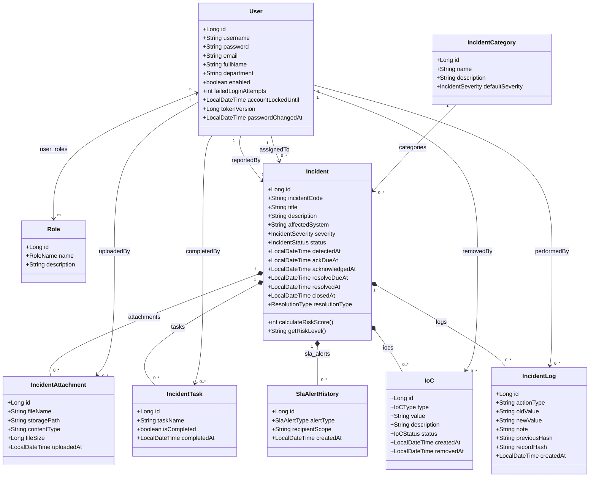
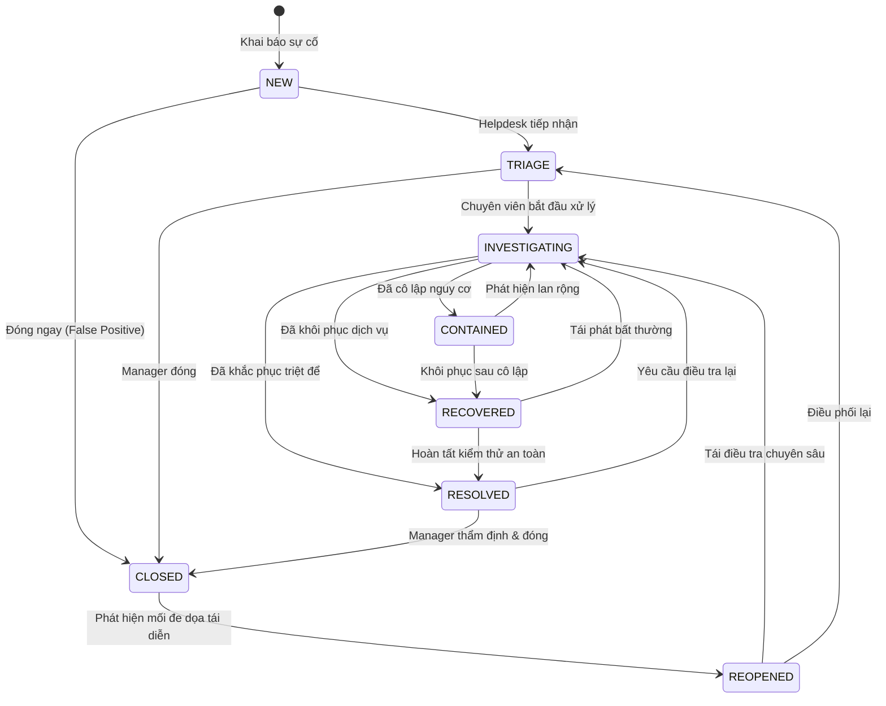
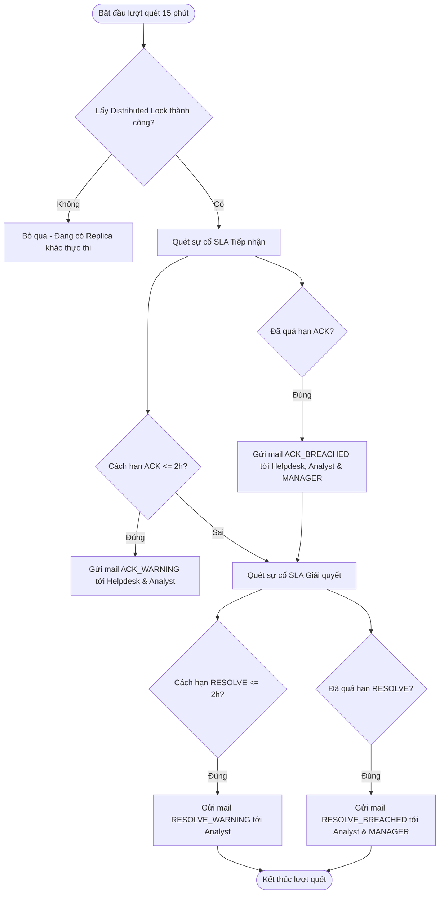

# BÁO CÁO THIẾT KẾ ĐỐI TƯỢNG VÀ ĐẶC TẢ NGHIỆP VỤ CHI TIẾT
## HỆ THỐNG QUẢN LÝ SỰ CỐ AN TOÀN THÔNG TIN CHUẨN SOC (SECURITY OPERATIONS CENTER)
**Học phần:** Phân tích và Thiết kế Hệ thống Thông tin (PTTK HTTT) 
**Đơn vị:** Học viện Công nghệ Bưu chính Viễn thông (PTIT) 
**Phiên bản tài liệu:** 1.0 — Chuẩn hóa theo mã nguồn & Kiến trúc triển khai thực tế

---

# MỤC LỤC
1. [TỔNG QUAN HỆ THỐNG VÀ CÁC TÁC NHÂN](#1-tổng-quan-hệ-thống-và-các-tác-nhân)
   - 1.1. Bối cảnh và Mục tiêu Hệ thống
   - 1.2. Danh mục Các Tác nhân Tham gia Hệ thống (Actors)
2. [THIẾT KẾ ĐỐI TƯỢNG DỮ LIỆU CHI TIẾT (ENTITY / OBJECT SPECIFICATION)](#2-thiết-kế-đối-tượng-dữ-liệu-chi-tiết)
   - 2.1. Đối tượng Người dùng & Vai trò (`User`, `Role`, `UserRole`)
   - 2.2. Đối tượng Sự cố ATTT (`Incident` - Thực thể trung tâm)
   - 2.3. Đối tượng Danh mục Phân loại Sự cố (`IncidentCategory`)
   - 2.4. Đối tượng Nhật ký Kiểm toán Chuỗi băm (`IncidentLog`)
   - 2.5. Đối tượng Chỉ số Thỏa hiệp (`IoC` - Indicator of Compromise)
   - 2.6. Đối tượng Nhiệm vụ Quy trình Ứng phó (`IncidentTask` / Playbook)
   - 2.7. Đối tượng Tệp Chứng cứ Đính kèm (`IncidentAttachment`)
   - 2.8. Đối tượng Lịch sử Cảnh báo SLA (`SlaAlertHistory`)
   - 2.9. Đối tượng Xác thực & An ninh (`RefreshToken`, `SecurityAuditLog`)
3. [MÔ HÌNH QUAN HỆ ĐỐI TƯỢNG (CLASS DIAGRAM & LOGICAL SCHEMA)](#3-mô-hình-quan-hệ-đối-tượng)
   - 3.1. Sơ đồ Lớp Thực thể (Mermaid Class Diagram)
   - 3.2. Bảng Ràng buộc Quan hệ & Tính Toàn vẹn Dữ liệu
4. [ĐẶC TẢ NGHIỆP VỤ CHI TIẾT (DETAILED BUSINESS PROCESSES)](#4-đặc-tả-nghiệp-vụ-chi-tiết)
   - 4.1. Nghiệp vụ Quản lý Định danh & Xác thực (IAM & Security)
   - 4.2. Nghiệp vụ Tiếp nhận & Khởi tạo Sự cố (Incident Ingestion & SLA Calculation)
   - 4.3. Nghiệp vụ Phân loại Sơ bộ & Điều phối Phân công (Triage & Assignment)
   - 4.4. Nghiệp vụ Điều tra, Thu thập Chứng cứ & Xử lý Kỹ thuật (Investigation & IoC Tracking)
   - 4.5. Nghiệp vụ Cô lập, Khắc phục & Đóng Sự cố (Containment, Resolution & Closure)
   - 4.6. Nghiệp vụ Tự động Giám sát SLA & Leo thang Cảnh báo (Automated SLA Escalation)
   - 4.7. Nghiệp vụ Kiểm toán Bất biến & Chống Giả mạo Dữ liệu (Tamper-evident Forensic Audit Trail)
   - 4.8. Nghiệp vụ Đo lường Hiệu năng SOC, Thống kê & Xuất Báo cáo
5. [MA TRẬN PHÂN QUYỀN TRUY CẬP (RBAC MATRIX)](#5-ma-trận-phân-quyền-truy-cập)
6. [BẢNG TẬP HỢP CÁC QUY TẮC NGHIỆP VỤ (BUSINESS RULES CATALOG)](#6-bảng-tập-hợp-các-quy-tắc-nghiệp-vụ)

---

# 1. TỔNG QUAN HỆ THỐNG VÀ CÁC TÁC NHÂN

## 1.1. Bối cảnh và Mục tiêu Hệ thống
Trong môi trường an ninh mạng doanh nghiệp, Trung tâm Điều hành An ninh mạng (**SOC - Security Operations Center**) đòi hỏi một quy trình quản lý sự cố chặt chẽ nhằm giảm thiểu tối đa thời gian phát hiện và thời gian khắc phục sự cố. Hệ thống **Quản lý Sự cố ATTT** được thiết kế dựa trên tiêu chuẩn quản lý sự cố quốc tế **NIST SP 800-61 Rev. 2** và chu trình **SANS Incident Response Framework** gồm 6 giai đoạn:
$$\text{Preparation} \longrightarrow \text{Identification} \longrightarrow \text{Containment} \longrightarrow \text{Eradication} \longrightarrow \text{Recovery} \longrightarrow \text{Lessons Learned}$$

**Mục tiêu cốt lõi của hệ thống:**
1. **Chuẩn hóa vòng đời sự cố:** Chuyển đổi trạng thái có kiểm soát nghiêm ngặt: `NEW` $\rightarrow$ `TRIAGE` $\rightarrow$ `INVESTIGATING` $\rightarrow$ `CONTAINED` $\rightarrow$ `RECOVERED` $\rightarrow$ `RESOLVED` $\rightarrow$ `CLOSED` (và `REOPENED` khi cần).
2. **Cam kết mức chất lượng dịch vụ (SLA Tracking):** Tự động tính toán thời hạn tiếp nhận ban đầu (MTTA - Mean Time to Acknowledge) và thời hạn giải quyết triệt để (MTTR - Mean Time to Resolve) dựa trên mức độ nghiêm trọng (`CRITICAL`, `HIGH`, `MEDIUM`, `LOW`).
3. **Truy vết chứng cứ số (Digital Forensics):** Hỗ trợ lưu trữ, phân loại các chỉ số thỏa hiệp (**IoC** - Indicators of Compromise), tài liệu bằng chứng đính kèm và danh mục nhiệm vụ ứng phó (**Playbook Tasks**).
4. **Nhật ký kiểm toán chống chối bỏ (Tamper-evident Audit Trail):** Sử dụng chuỗi băm mật mã học **SHA-256** liên kết tuần tự (tương tự công nghệ Blockchain) để đảm bảo toàn vẹn nhật ký xử lý sự cố, không thể bị xóa sửa trái phép.
5. **Bảo mật dữ liệu tối cao:** Mã hóa trường dữ liệu mô tả nhạy cảm bằng **AES-GCM 256-bit**, cơ chế chống Brute-Force lockout tài khoản, phân quyền dựa trên vai trò (**RBAC**).

---

## 1.2. Danh mục Các Tác nhân Tham gia Hệ thống (Actors)

| Tác nhân (Actor) | Vai trò hệ thống | Trách nhiệm và Quyền hạn chính |
| :--- | :--- | :--- |
| **Quản trị viên (ADMIN)** | `ROLE_ADMIN` | Toàn quyền quản trị người dùng, phân vai trò, mở/khóa tài khoản, cấu hình tham số hệ thống, giám sát nhật ký an ninh hệ thống (`SecurityAuditLog`). |
| **Quản lý SOC (MANAGER)** | `ROLE_MANAGER` | Giám sát toàn bộ sự cố, thẩm định chất lượng xử lý, phê duyệt đóng sự cố (`CLOSED`), phân loại bản chất sự cố (`ResolutionType`: True/False Positive), xem báo cáo điều hành và nhận cảnh báo leo thang SLA. |
| **Điều phối viên (HELPDESK)** | `ROLE_HELPDESK` | Trực bàn tiếp nhận sơ bộ (Tier-1 SOC), xác minh sự cố mới, thực hiện chuyển trạng thái sang `TRIAGE`, điều phối và phân công sự cố cho Chuyên viên (`ANALYST`) phù hợp. |
| **Chuyên viên SOC (ANALYST)** | `ROLE_ANALYST` | Chuyên viên kỹ thuật điều tra và xử lý (Tier-2/Tier-3 SOC). Tiếp nhận điều tra, cập nhật IoC, hoàn thành nhiệm vụ playbook, cô lập hệ thống, đưa hệ thống về trạng thái an toàn và chuyển trạng thái sự cố sang `RESOLVED`. |
| **Người báo cáo (REPORTER)** | `ROLE_REPORTER` | Cán bộ nhân viên toàn đơn vị. Khai báo các sự cố hoặc dấu hiệu bất thường về ATTT, theo dõi tiến độ và nhận phản hồi của các sự cố do chính mình báo cáo. |
| **Tác nhân Hệ thống (SYSTEM)** | `Scheduler / Internal` | Tiến trình ngầm tự động: Quét kiểm tra SLA định kỳ 15 phút/lần, gửi email cảnh báo tự động, phát tín hiệu thời gian thực qua WebSocket, tự động tính Risk Score và băm mã kiểm toán. |

---

# 2. THIẾT KẾ ĐỐI TƯỢNG DỮ LIỆU CHI TIẾT

## 2.1. Đối tượng Người dùng & Vai trò (`User`, `Role`, `UserRole`)

### A. Đối tượng `Role` (Vai trò)
- **Ý nghĩa nghiệp vụ:** Định nghĩa danh mục vai trò người dùng trong hệ thống RBAC, kiểm soát phân quyền truy cập endpoint và hành vi nghiệp vụ.
- **Thuộc tính:**
  | Thuộc tính | Kiểu dữ liệu | Ràng buộc | Diễn giải |
  | :--- | :--- | :--- | :--- |
  | `id` | `Long` | PK, Auto Increment | Mã định danh vai trò |
  | `name` | `RoleName` (Enum) | NOT NULL, UNIQUE, varchar(30) | Tên vai trò: `ADMIN`, `MANAGER`, `HELPDESK`, `ANALYST`, `REPORTER` |
  | `description` | `String` | varchar(255) | Mô tả chi tiết vai trò và quyền hạn |

### B. Đối tượng `User` (Người dùng)
- **Ý nghĩa nghiệp vụ:** Lưu trữ thông tin tài khoản cán bộ nhân viên, thông tin an ninh tài khoản, trạng thái khóa và quản lý phiên.
- **Thuộc tính:**
  | Thuộc tính | Kiểu dữ liệu | Ràng buộc | Diễn giải |
  | :--- | :--- | :--- | :--- |
  | `id` | `Long` | PK, Auto Increment | Mã định danh người dùng |
  | `username` | `String` | NOT NULL, UNIQUE, varchar(100) | Tên tài khoản đăng nhập |
  | `password` | `String` | NOT NULL, varchar(255) | Mật khẩu băm (BCrypt Hash) |
  | `email` | `String` | NOT NULL, UNIQUE, varchar(150) | Email nhận thông báo và cảnh báo SLA |
  | `fullName` | `String` | varchar(150) | Họ và tên đầy đủ |
  | `department` | `String` | varchar(100) | Phòng ban / Đơn vị công tác |
  | `enabled` | `boolean` | NOT NULL, Default: `true` | Trạng thái hoạt động tài khoản |
  | `failedLoginAttempts`| `int` | NOT NULL, Default: `0` | Số lần đăng nhập thất bại liên tiếp |
  | `accountLockedUntil` | `LocalDateTime` | Nullable | Thời điểm hết hạn khóa tạm thời do brute-force |
  | `tokenVersion` | `Long` | NOT NULL, Default: `0` | Phiên bản token dùng để thu hồi tức thì toàn bộ JWT cũ |
  | `passwordChangedAt` | `LocalDateTime` | Nullable | Thời điểm đổi mật khẩu gần nhất |
  | `createdAt` | `LocalDateTime` | NOT NULL, Default: `now()` | Thời điểm tạo tài khoản |
  | `updatedAt` | `LocalDateTime` | Nullable | Thời điểm cập nhật thông tin |
- **Quan hệ:**
  - $n - n$ với `Role` thông qua bảng liên kết `user_roles`.
  - $1 - n$ với `Incident` (vai trò `reportedBy` - người báo cáo).
  - $1 - n$ với `Incident` (vai trò `assignedTo` - chuyên viên xử lý).

---

## 2.2. Đối tượng Sự cố ATTT (`Incident` - Thực thể trung tâm)

- **Ý nghĩa nghiệp vụ:** Thực thể trọng tâm quản lý toàn bộ vòng đời của một sự cố an ninh mạng từ lúc tiếp nhận, phân tích, xử lý đến khi đóng sự cố.
- **Thuộc tính chi tiết:**
  | Thuộc tính | Kiểu dữ liệu | Ràng buộc | Diễn giải |
  | :--- | :--- | :--- | :--- |
  | `id` | `Long` | PK, Auto Increment | Mã định danh nội bộ |
  | `incidentCode` | `String` | NOT NULL, UNIQUE, varchar(30) | Mã sự cố hiển thị chuẩn `INC-YYYY-XXXXXX` |
  | `title` | `String` | NOT NULL, varchar(255) | Tiêu đề tóm tắt sự cố |
  | `description` | `String` | TEXT (Mã hóa AES-GCM) | Mô tả chi tiết sự cố (được tự động mã hóa AES-GCM trong DB) |
  | `affectedSystem` | `String` | varchar(255) | Hệ thống/máy chủ bị ảnh hưởng (vd: Core Banking, Web Portal) |
  | `category` | `IncidentCategory` | FK $\rightarrow$ `incident_categories.id` | Loại sự cố ATTT |
  | `severity` | `IncidentSeverity` (Enum) | NOT NULL, varchar(20) | Mức độ nghiêm trọng: `LOW`, `MEDIUM`, `HIGH`, `CRITICAL` |
  | `status` | `IncidentStatus` (Enum) | NOT NULL, varchar(30) | Trạng thái vòng đời sự cố |
  | `reportedBy` | `User` | FK $\rightarrow$ `users.id` | Người phát hiện/khai báo sự cố |
  | `assignedTo` | `User` | FK $\rightarrow$ `users.id`, Nullable | Chuyên viên SOC được phân công xử lý |
  | `detectedAt` | `LocalDateTime` | Nullable | Thời điểm phát hiện sự cố trên thực tế |
  | `ackDueAt` | `LocalDateTime` | Nullable, Indexed | Hạn chót tiếp nhận sự cố theo SLA (MTTA Target) |
  | `acknowledgedAt` | `LocalDateTime` | Nullable | Thời điểm thực tế sự cố được tiếp nhận (`TRIAGE`/`INVESTIGATING`) |
  | `resolveDueAt` | `LocalDateTime` | Nullable, Indexed | Hạn chót giải quyết sự cố theo SLA (MTTR Target) |
  | `resolvedAt` | `LocalDateTime` | Nullable | Thời điểm chuyên viên hoàn thành khắc phục (`RESOLVED`) |
  | `closedAt` | `LocalDateTime` | Nullable | Thời điểm Manager/Admin phê duyệt đóng sự cố (`CLOSED`) |
  | `resolutionType` | `ResolutionType` (Enum) | Nullable, varchar(30) | Kết luận bản chất: `TRUE_POSITIVE`, `FALSE_POSITIVE`, `BENIGN`, `NOT_APPLICABLE` |
  | `slaWarningSent` | `boolean` | NOT NULL, Default: `false` | Cờ ghi nhận đã gửi cảnh báo SLA sắp hạn hay chưa |
  | `version` | `long` | NOT NULL, Default: `0` | Trường hỗ trợ Optimistic Locking chống xung đột ghi đồng thời |
  | `createdAt` | `LocalDateTime` | NOT NULL, Default: `now()` | Thời điểm tạo sự cố trên hệ thống |
  | `updatedAt` | `LocalDateTime` | Nullable | Thời điểm cập nhật thông tin gần nhất |

- **Các trường tính toán động (Derived Fields / Non-persistent):**
  - `riskScore`: Điểm rủi ro tính theo thang 0 - 100 dựa trên Severity, số lượng IoC, tính chất hệ thống cốt lõi và tình trạng vi phạm SLA.
  - `riskLevel`: Xếp loại mức rủi ro động: `CRITICAL` ($\ge 75$), `HIGH` ($\ge 50$), `MEDIUM` ($\ge 25$), `LOW` ($< 25$).

---

## 2.3. Đối tượng Danh mục Phân loại Sự cố (`IncidentCategory`)

- **Ý nghĩa nghiệp vụ:** Phân loại sự cố an ninh mạng theo chuẩn chuẩn hóa (Phishing, Malware, Data Leak, DoS, Unauthorized Access,...). Giúp thiết lập mức nghiêm trọng mặc định và tự động gắn checklist ứng phó ban đầu (Playbook Tasks).
- **Thuộc tính:**
  | Thuộc tính | Kiểu dữ liệu | Ràng buộc | Diễn giải |
  | :--- | :--- | :--- | :--- |
  | `id` | `Long` | PK, Auto Increment | Mã danh mục |
  | `name` | `String` | NOT NULL, UNIQUE, varchar(100) | Tên loại sự cố (vd: Tấn công giả mạo - Phishing) |
  | `description` | `String` | varchar(500) | Hướng dẫn nhận diện và phạm vi loại sự cố |
  | `defaultSeverity` | `IncidentSeverity` | varchar(20) | Mức độ nghiêm trọng gợi ý mặc định |

---

## 2.4. Đối tượng Nhật ký Kiểm toán Chuỗi băm (`IncidentLog`)

- **Ý nghĩa nghiệp vụ:** Lưu vết toàn bộ lịch sử thao tác trên sự cố (đổi trạng thái, phân công, bình luận, thêm/xóa IoC, đổi thông tin). Dữ liệu là **Append-only** (chỉ thêm, không xóa sửa).
- **Cơ chế Blockchain Hash Chaining:** Mỗi bản ghi log được liên kết mật mã với bản ghi log liền trước thông qua trường `previousHash` và tự sinh ra `recordHash` bằng thuật toán SHA-256.
- **Thuộc tính:**
  | Thuộc tính | Kiểu dữ liệu | Ràng buộc | Diễn giải |
  | :--- | :--- | :--- | :--- |
  | `id` | `Long` | PK, Auto Increment | Mã định danh bản ghi log |
  | `incident` | `Incident` | FK $\rightarrow$ `incidents.id`, Cascade Delete | Sự cố liên kết |
  | `performedBy` | `User` | FK $\rightarrow$ `users.id` | Người thực hiện thao tác |
  | `actionType` | `String` | NOT NULL, varchar(50) | Loại hành động: `CREATE`, `STATUS_CHANGE`, `ASSIGNMENT`, `COMMENT`, `UPDATE`, `ADD_IOC`, `REMOVE_IOC`, `ADD_TASK`, `UPDATE_TASK` |
  | `oldValue` | `String` | varchar(255) | Giá trị cũ trước khi sửa đổi |
  | `newValue` | `String` | varchar(255) | Giá trị mới sau khi sửa đổi |
  | `note` | `String` | TEXT | Nội dung ghi chú, giải trình kỹ thuật hoặc biên bản |
  | `previousHash` | `String` | varchar(128) | Giá trị băm SHA-256 của bản ghi log trước đó |
  | `recordHash` | `String` | varchar(128) | Giá trị băm SHA-256 của chính bản ghi hiện tại |
  | `createdAt` | `LocalDateTime` | NOT NULL, Default: `now()` | Thời điểm thực hiện hành động |

---

## 2.5. Đối tượng Chỉ số Thỏa hiệp (`IoC` - Indicator of Compromise)

- **Ý nghĩa nghiệp vụ:** Quản lý bằng chứng kỹ thuật và các dấu hiệu nhận biết xâm nhập số phục vụ điều tra số (Forensics) và cấu hình chặn lọc trên Firewall/SIEM/EDR.
- **Thuộc tính:**
  | Thuộc tính | Kiểu dữ liệu | Ràng buộc | Diễn giải |
  | :--- | :--- | :--- | :--- |
  | `id` | `Long` | PK, Auto Increment | Mã chỉ số IoC |
  | `incident` | `Incident` | FK $\rightarrow$ `incidents.id` | Sự cố phát hiện IoC này |
  | `type` | `IoCType` (Enum) | NOT NULL, varchar(30) | Phân loại IoC: `IPV4`, `DOMAIN`, `URL`, `MD5_HASH`, `SHA256_HASH`, `EMAIL_ADDRESS`, `FILE_PATH` |
  | `value` | `String` | NOT NULL, varchar(255) | Giá trị kỹ thuật cụ thể (vd: `192.168.1.100`, `malware.exe`) |
  | `description` | `String` | TEXT | Ghi chú ngữ cảnh phát hiện (vd: C&C Server) |
  | `status` | `IoCStatus` (Enum) | NOT NULL, Default: `ACTIVE` | Trạng thái: `ACTIVE` (đang có hiệu lực), `REMOVED` (đã loại trừ) |
  | `createdAt` | `LocalDateTime` | NOT NULL, Default: `now()` | Thời điểm thêm IoC |
  | `removedAt` | `LocalDateTime` | Nullable | Thời điểm gỡ bỏ/loại trừ |
  | `removedBy` | `User` | FK $\rightarrow$ `users.id`, Nullable | Người thẩm định gỡ bỏ IoC |

---

## 2.6. Đối tượng Nhiệm vụ Quy trình Ứng phó (`IncidentTask` / Playbook)

- **Ý nghĩa nghiệp vụ:** Chia nhỏ quy trình xử lý sự cố thành các bước hành động cụ thể (SOP - Standard Operating Procedure) theo từng danh mục tấn công.
- **Thuộc tính:**
  | Thuộc tính | Kiểu dữ liệu | Ràng buộc | Diễn giải |
  | :--- | :--- | :--- | :--- |
  | `id` | `Long` | PK, Auto Increment | Mã nhiệm vụ |
  | `incident` | `Incident` | FK $\rightarrow$ `incidents.id` | Sự cố chứa nhiệm vụ này |
  | `taskName` | `String` | NOT NULL, varchar(255) | Tên đầu việc (vd: "Cô lập máy chủ", "Reset mật khẩu") |
  | `isCompleted` | `boolean` | NOT NULL, Default: `false` | Trạng thái hoàn thành bước xử lý |
  | `completedAt` | `LocalDateTime` | Nullable | Thời điểm hoàn thành |
  | `completedBy` | `User` | FK $\rightarrow$ `users.id`, Nullable | Chuyên viên đã hoàn thành công việc |

---

## 2.7. Đối tượng Tệp Chứng cứ Đính kèm (`IncidentAttachment`)

- **Ý nghĩa nghiệp vụ:** Lưu trữ các tệp bằng chứng số: file log trích xuất, ảnh chụp màn hình hiện trường, mẫu email lừa đảo (.eml), gói tin bắt được (.pcap).
- **Thuộc tính:**
  | Thuộc tính | Kiểu dữ liệu | Ràng buộc | Diễn giải |
  | :--- | :--- | :--- | :--- |
  | `id` | `Long` | PK, Auto Increment | Mã tài liệu đính kèm |
  | `incident` | `Incident` | FK $\rightarrow$ `incidents.id` | Sự cố liên kết |
  | `fileName` | `String` | NOT NULL, varchar(255) | Tên tệp gốc do người dùng tải lên |
  | `storagePath` | `String` | NOT NULL, varchar(500) | Đường dẫn lưu trữ an toàn trên máy chủ lưu trữ |
  | `contentType` | `String` | varchar(100) | Định dạng MIME của tệp (vd: `image/png`, `application/pdf`) |
  | `fileSize` | `Long` | Bigint | Dung lượng tệp tính bằng byte |
  | `uploadedBy` | `User` | FK $\rightarrow$ `users.id` | Cán bộ tải tệp lên |
  | `uploadedAt` | `LocalDateTime` | NOT NULL, Default: `now()` | Thời điểm tải lên |

---

## 2.8. Đối tượng Lịch sử Cảnh báo SLA (`SlaAlertHistory`)

- **Ý nghĩa nghiệp vụ:** Ghi nhận lịch sử gửi email cảnh báo vi phạm thời gian SLA, bảo đảm tính duy nhất và chống gửi lặp cảnh báo (Idempotency).
- **Thuộc tính:**
  | Thuộc tính | Kiểu dữ liệu | Ràng buộc | Diễn giải |
  | :--- | :--- | :--- | :--- |
  | `id` | `Long` | PK, Auto Increment | Mã bản ghi cảnh báo |
  | `incident` | `Incident` | FK $\rightarrow$ `incidents.id` | Sự cố bị cảnh báo |
  | `alertType` | `SlaAlertType` (Enum) | NOT NULL, varchar(30) | Loại vi phạm: `ACK_WARNING`, `ACK_BREACHED`, `RESOLVE_WARNING`, `RESOLVE_BREACHED` |
  | `recipientScope`| `String` | NOT NULL, varchar(30) | Phạm vi gửi: `OPERATIONAL` (Chuyên viên/Helpdesk), `ESCALATED` (Quản lý SOC) |
  | `recipientKey` | `String` | NOT NULL, varchar(200) | Định danh người nhận đã nhận email thành công, phục vụ retry cục bộ |
  | `createdAt` | `LocalDateTime` | NOT NULL, Default: `now()` | Thời điểm gửi cảnh báo |

> **Ràng buộc duy nhất (Unique Constraint):** Bộ `(incident_id, alert_type, recipient_key)` là UNIQUE để không gửi lặp cho người đã nhận, đồng thời vẫn retry được riêng người nhận gặp lỗi.

---

## 2.9. Đối tượng Xác thực & An ninh (`RefreshToken`, `SecurityAuditLog`)

### A. Đối tượng `RefreshToken`
- **Ý nghĩa nghiệp vụ:** Lưu trữ token làm mới phiên đăng nhập dạng HttpOnly Secure Cookie, hỗ trợ xoay vòng token (Token Rotation) và phòng ngừa tấn công đánh cắp phiên.
- **Thuộc tính:** `id` (PK), `user` (FK), `token` (Unique), `expiryDate` (Thời điểm hết hạn).

### B. Đối tượng `SecurityAuditLog`
- **Ý nghĩa nghiệp vụ:** Ghi nhận các sự kiện bảo mật toàn hệ thống: brute-force login thất bại, tài khoản bị khóa, truy cập trái quyền, đặt lại mật khẩu admin.
- **Thuộc tính:** `id` (PK), `username`, `ipAddress`, `action`, `details`, `createdAt`.

---

# 3. MÔ HÌNH QUAN HỆ ĐỐI TƯỢNG

## 3.1. Sơ đồ Lớp Thực thể (Mermaid Class Diagram)

## 3.2. Bảng Ràng buộc Quan hệ & Tính Toàn vẹn Dữ liệu

| Bảng nguồn | Bảng đích | Khóa ngoại | Bản số (Cardinality) | Hành vi khi Xóa bản ghi cha (On Delete) |
| :--- | :--- | :--- | :--- | :--- |
| `user_roles` | `users` | `user_id` | $n - 1$ | `CASCADE` |
| `user_roles` | `roles` | `role_id` | $n - 1$ | `CASCADE` |
| `incidents` | `incident_categories` | `category_id` | $n - 1$ | `RESTRICT / NO ACTION` (Không xóa danh mục nếu đang có sự cố) |
| `incidents` | `users` | `reported_by` | $n - 1$ | `RESTRICT` |
| `incidents` | `users` | `assigned_to` | $n - 1$ | `SET NULL` |
| `incident_logs` | `incidents` | `incident_id` | $n - 1$ | `CASCADE` |
| `incident_logs` | `users` | `performed_by` | $n - 1$ | `RESTRICT` |
| `incident_iocs` | `incidents` | `incident_id` | $n - 1$ | `CASCADE` |
| `incident_tasks` | `incidents` | `incident_id` | $n - 1$ | `CASCADE` |
| `incident_tasks` | `users` | `completed_by` | $n - 1$ | `SET NULL` |
| `incident_attachments`| `incidents` | `incident_id` | $n - 1$ | `CASCADE` |
| `sla_alert_history` | `incidents` | `incident_id` | $n - 1$ | `CASCADE` |

---

# 4. ĐẶC TẢ NGHIỆP VỤ CHI TIẾT

## 4.1. Nghiệp vụ Quản lý Định danh & Xác thực (IAM & Security)

### A. Quy trình Đăng nhập & Kiểm soát Tấn công Brute-force
1. **Tiếp nhận yêu cầu:** Người dùng gửi `username` và `password` qua API `POST /api/auth/login`.
2. **Kiểm tra trạng thái IP & Khóa tài khoản:**
   - Hệ thống kiểm tra trong bộ nhớ đệm `LoginAttemptService`: Nếu địa chỉ IP client đang bị chặn, hoặc tài khoản đang trong thời gian bị khóa (`accountLockedUntil > now()`), hệ thống trả về ngay lỗi `401 Unauthorized`.
   - **Bảo mật chống Enumeration Attack:** Mọi trường hợp thất bại (sai mật khẩu, tài khoản không tồn tại, tài khoản bị vô hiệu hóa, tài khoản bị khóa) đều trả về một thông báo lỗi duy nhất: `"Tên đăng nhập hoặc mật khẩu không đúng."`
3. **Xử lý đăng nhập thất bại:**
   - Nếu đăng nhập sai lần thứ $1 \rightarrow 4$: Tăng biến đếm `failedLoginAttempts`.
   - Nếu đạt ngưỡng 5 lần thất bại liên tiếp: Khóa tài khoản trong thời gian định cấu hình (mặc định 15 phút), ghi nhật ký an ninh vào `SecurityAuditLog`.
4. **Xử lý đăng nhập thành công:**
   - Reset `failedLoginAttempts = 0`, xóa mốc khóa `accountLockedUntil`.
   - Cấp phát cặp token: **Access Token** (JWT, thời hạn ngắn 15 phút, chứa username, roles, tokenVersion) và **Refresh Token** (Lưu trong DB và trả về qua HttpOnly Cookie an toàn).

### B. Chính sách Mật khẩu (Password Policy)
Mật khẩu người dùng bắt buộc thỏa mãn toàn bộ tiêu chí an toàn (kiểm tra bởi `PasswordPolicy`):
- Độ dài tối thiểu 12 ký tự, tối đa 72 ký tự (giới hạn an toàn của thuật toán băm BCrypt).
- Chứa ít nhất một ký tự viết hoa (`A-Z`).
- Chứa ít nhất một ký tự viết thường (`a-z`).
- Chứa ít nhất một chữ số (`0-9`).
- Chứa ít nhất một ký tự đặc biệt (`!@#$%^&*()_+-=[]{}|;:,.<>?`).

---

## 4.2. Nghiệp vụ Tiếp nhận & Khởi tạo Sự cố (Incident Ingestion & SLA Calculation)

### A. Khởi tạo Sự cố Mới
1. **Người thực hiện:** Mọi tài khoản có quyền `REPORTER`, `HELPDESK`, `ANALYST`, `MANAGER`, `ADMIN`.
2. **Quy tắc sinh mã sự cố tự động (Incident Code):**
   - Sinh mã duy nhất dạng: `INC-YYYY-XXXXXX` (Trong đó `YYYY` là năm hiện tại, `XXXXXX` là số thứ tự 6 chữ số tăng dần từ PostgreSQL Sequence). Ví dụ: `INC-2026-000001`.
3. **Quy tắc tính toán thời hạn SLA tự động:**
   Thời hạn giải quyết (MTTR) và tiếp nhận (MTTA) được tính tự động từ thời điểm tạo dựa theo ma trận:
   | Mức độ (Severity) | Thời hạn Giải quyết (`resolveDueAt`) | Thời hạn Tiếp nhận (`ackDueAt`) | Công thức tính tiếp nhận |
   | :--- | :--- | :--- | :--- |
   | **CRITICAL** | $4 \text{ giờ}$ | $1 \text{ giờ}$ | $\max(1, \text{ResolveHours} / 4)$ |
   | **HIGH** | $24 \text{ giờ}$ | $6 \text{ giờ}$ | $\max(1, \text{ResolveHours} / 4)$ |
   | **MEDIUM** | $48 \text{ giờ}$ | $12 \text{ giờ}$ | $\max(1, \text{ResolveHours} / 4)$ |
   | **LOW** | $72 \text{ giờ}$ | $18 \text{ giờ}$ | $\max(1, \text{ResolveHours} / 4)$ |

4. **Tự động gắn Playbook Tasks (Quy trình ứng phó mẫu):**
   Dựa trên tên danh mục được chọn, hệ thống tự động khởi tạo danh sách các đầu việc chuẩn:
   - *Phishing:* (1) Cô lập email nghi ngờ $\rightarrow$ (2) Block sender/domain $\rightarrow$ (3) Reset mật khẩu tài khoản $\rightarrow$ (4) Kiểm tra mailbox rules.
   - *Mã độc / Malware:* (1) Cô lập thiết bị $\rightarrow$ (2) Quét EDR/antivirus $\rightarrow$ (3) Thu thập hash mẫu $\rightarrow$ (4) Kiểm tra lateral movement.
   - *Rò rỉ dữ liệu:* (1) Khoanh vùng dữ liệu lộ lọt $\rightarrow$ (2) Vô hiệu hóa tài khoản $\rightarrow$ (3) Đánh giá phạm vi $\rightarrow$ (4) Báo cáo Manager.
   - *Truy cập trái phép:* (1) Vô hiệu hóa phiên đăng nhập $\rightarrow$ (2) Reset xác thực $\rightarrow$ (3) Rà soát access log $\rightarrow$ (4) Kiểm tra cấu hình.
5. **Thông báo tức thời:**
   - Gửi email xác nhận tiếp nhận đến `reportedBy`.
   - Gửi email thông báo sự cố mới cần phân công đến toàn bộ chuyên viên `HELPDESK`.
   - Phát sự kiện WebSocket qua kênh `/topic/incidents` để cập nhật Dashboard trực tiếp.

---

## 4.3. Nghiệp vụ Phân loại Sơ bộ & Điều phối Phân công (Triage & Assignment)

### A. Phân loại Sơ bộ (Triage)
- Đội ngũ Helpdesk kiểm tra tính hợp lệ của thông tin khai báo.
- Chuyển trạng thái từ `NEW` $\rightarrow$ `TRIAGE`.
- Khi chuyển sang `TRIAGE`, hệ thống tự động ghi nhận thời điểm tiếp nhận thực tế (`acknowledgedAt = now()`), hoàn thành chỉ số SLA MTTA.

### B. Điều phối & Phân công Chuyên viên (Assignment)
1. **Thẩm quyền phân công:**
   - `HELPDESK`: Chỉ được phép phân công khi sự cố ở trạng thái `NEW` hoặc `TRIAGE`.
   - `MANAGER` / `ADMIN`: Có quyền phân công hoặc tái phân công ở mọi trạng thái.
2. **Quy tắc chọn người xử lý:**
   - Tài khoản được phân công bắt buộc phải có vai trò `ROLE_ANALYST` và tài khoản đang hoạt động (`enabled = true`).
3. **Hành động hệ thống:**
   - Cập nhật trường `assigned_to` của sự cố.
   - Ghi nhật ký kiểm toán: `actionType = "ASSIGNMENT"`, lưu `oldValue` (người cũ) và `newValue` (người mới).
   - Đẩy thông báo WebSocket riêng biệt đến kênh cá nhân của chuyên viên: `/topic/user.{username}.assignments`.

---

## 4.4. Nghiệp vụ Điều tra, Thu thập Chứng cứ & Xử lý Kỹ thuật (Investigation & IoC Tracking)

### A. Tiến trình Điều tra & Quản lý Máy Trạng thái (State Machine)
Quy trình chuyển trạng thái được kiểm soát chặt chẽ bởi bộ xác thực `IncidentStatusTransitionValidator`:

### B. Quản lý Chỉ số Thỏa hiệp (IoC Management)
- Chuyên viên có thể thêm nhiều IoC thuộc các định dạng: `IPV4`, `DOMAIN`, `URL`, `MD5_HASH`, `SHA256_HASH`, `EMAIL_ADDRESS`, `FILE_PATH`.
- **Nguyên tắc không xóa vật lý (Soft-Delete):** Khi một IoC được xác định là vô hại hoặc bị loại trừ, hệ thống chuyển `status = REMOVED`, lưu thời điểm `removedAt` và danh tính `removedBy`. Mọi IoC đã ghi nhận đều lưu vết trong biên bản kiểm toán.

### C. Thuật toán Tính Điểm Rủi ro Động (Dynamic Risk Score Formula)
Hệ thống không chỉ dựa vào mức độ nghiêm trọng tĩnh (Severity) mà tự động tính toán **Điểm rủi ro (0 - 100)** thời gian thực theo công thức:

$$\text{RiskScore} = \min\Big(100,\; S_{\text{base}} + S_{\text{ioc}} + S_{\text{system}} + S_{\text{ack\_breach}} + S_{\text{resolve\_breach}}\Big)$$

Trong đó:
1. **Điểm cơ bản theo Mức độ nghiêm trọng ($S_{\text{base}}$):**
   - `LOW`: 10 điểm
   - `MEDIUM`: 25 điểm
   - `HIGH`: 50 điểm
   - `CRITICAL`: 75 điểm
2. **Điểm tích lũy theo số IoC đang hoạt động ($S_{\text{ioc}}$):**
   - Mỗi IoC ở trạng thái `ACTIVE` cộng thêm 5 điểm: $S_{\text{ioc}} = \min(15, \text{activeIoCs} \times 5)$.
3. **Điểm trọng yếu của hệ thống bị ảnh hưởng ($S_{\text{system}}$):**
   - Nếu `affectedSystem` chứa các từ khóa trọng yếu: `"core"`, `"database"`, `"payment"`, `"production"` $\rightarrow$ Cộng thêm **15 điểm**.
4. **Điểm phạt vi phạm SLA tiếp nhận ($S_{\text{ack\_breach}}$):**
   - Sự cố chưa được tiếp nhận (`acknowledgedAt == null`) và đã quá hạn `ackDueAt` $\rightarrow$ Cộng thêm **10 điểm**.
5. **Điểm phạt vi phạm SLA giải quyết ($S_{\text{resolve\_breach}}$):**
   - Sự cố chưa hoàn thành và đã vượt quá `resolveDueAt` $\rightarrow$ Cộng thêm **20 điểm**.

---

## 4.5. Nghiệp vụ Cô lập, Khắc phục & Đóng Sự cố (Containment, Resolution & Closure)

### A. Giải quyết Sự cố (`RESOLVED`)
- **Điều kiện:** Chuyên viên xử lý (`assignedTo`) hoặc Quản lý (`MANAGER`/`ADMIN`) thực hiện.
- **Ràng buộc:** Bắt buộc nhập nội dung ghi chú giải trình (`request.note`).
- **Hành động hệ thống:** Ghi nhận mốc thời gian hoàn tất kỹ thuật `resolvedAt = now()`.

### B. Thẩm định & Đóng Sự cố (`CLOSED`)
- **Phân quyền độc quyền:** Chỉ tài khoản có vai trò `MANAGER` hoặc `ADMIN` mới có quyền đóng sự cố.
- **Ràng buộc bắt buộc:**
  1. Phải nhập nội dung ghi chú kết luận kiểm toán.
  2. Bắt buộc lựa chọn loại kết luận (**Resolution Type**):
     - `TRUE_POSITIVE`: Sự cố an ninh mạng có thật và chính xác.
     - `FALSE_POSITIVE`: Cảnh báo giả mạo / Báo động nhầm từ hệ thống giám sát.
     - `BENIGN`: Hành vi bất thường nhưng là hoạt động hợp lệ của người dùng/hệ thống.
     - `NOT_APPLICABLE`: Không thuộc phạm vi xử lý của SOC.
- **Hành động hệ thống:** Ghi nhận `closedAt = now()`, cập nhật `resolution_type`.

### C. Mở lại Sự cố (`REOPENED`)
- Khi sự cố đã đóng nhưng xuất hiện dấu hiệu tấn công trở lại từ cùng nguồn đe dọa.
- Hệ thống xóa các mốc `closedAt`, `resolvedAt`, `resolutionType` để đưa quy trình về trạng thái điều tra tiếp diễn.

---

## 4.6. Nghiệp vụ Tự động Giám sát SLA & Leo thang Cảnh báo (Automated SLA Escalation)

Hệ thống triển khai một tác vụ nền tự động (`SlaMonitorJob`) chạy định kỳ **15 phút/lần** (900.000 ms).

### Các Cấp độ Cảnh báo & Ma trận Leo thang (Escalation Matrix):
1. **`ACK_WARNING`:** Sự cố ở trạng thái `NEW`, chưa tiếp nhận và thời hạn còn lại $\le 2\text{ giờ}$.
   - *Đối tượng nhận:* Chuyên viên tiếp nhận `HELPDESK` và Chuyên viên được gán (nếu có).
2. **`ACK_BREACHED`:** Sự cố đã vượt quá thời hạn tiếp nhận (`now > ackDueAt`).
   - *Cơ chế leo thang:* Gửi thông báo đến `HELPDESK` và **leo thang khẩn cấp lên Quản lý SOC (`MANAGER`)**.
3. **`RESOLVE_WARNING`:** Sự cố chưa giải quyết và thời hạn giải quyết còn lại $\le 2\text{ giờ}$.
   - *Đối tượng nhận:* Chuyên viên được phân công (`assignedTo`).
4. **`RESOLVE_BREACHED`:** Sự cố vi phạm thời hạn giải quyết cam kết (`now > resolveDueAt`).
   - *Cơ chế leo thang:* Gửi email cảnh báo vi phạm trực tiếp đến chuyên viên và **leo thang đến toàn bộ Quản lý SOC (`MANAGER`)**.

---

## 4.7. Nghiệp vụ Kiểm toán Bất biến & Chống Giả mạo Dữ liệu (Tamper-evident Forensic Audit Trail)

Mọi thao tác thay đổi trạng thái, bình luận hoặc phân công đều tạo ra một bản ghi trong `IncidentLog` theo cơ chế chuỗi băm:

### Thuật toán Tạo Chuỗi Băm SHA-256 (`IncidentAuditService`):
1. Truy vấn mã băm `previousHash` của bản ghi log gần nhất thuộc cùng sự cố đó. (Nếu là log đầu tiên, `previousHash = ""`).
2. Tập hợp chuỗi payload tiêu chuẩn:
   $$\text{Payload} = \text{previousHash} \mathbin{\Vert} \text{incidentId} \mathbin{\Vert} \text{actorId} \mathbin{\Vert} \text{actionType} \mathbin{\Vert} \text{oldValue} \mathbin{\Vert} \text{newValue} \mathbin{\Vert} \text{note} \mathbin{\Vert} \text{createdAt}$$
3. Tính toán mã băm bản ghi:
   $$\text{recordHash} = \text{HexEncode}\Big(\text{SHA-256}(\text{Payload})\Big)$$
4. Lưu bản ghi xuống cơ sở dữ liệu. Nhờ cơ chế này, nếu bất kỳ ai can thiệp trực tiếp vào DB để sửa đổi `oldValue`, `newValue`, `note` hoặc hoán đổi người thao tác, chuỗi giá trị băm sẽ bị gãy và phát hiện gian lận tức thì trong quá trình giám định pháp y số (Forensic Audit).

### Mã hóa Dữ liệu Nhạy cảm Lưu trữ (Data-at-Rest Encryption):
- Cột `description` trong bảng `incidents` được cấu hình `@Convert(converter = EncryptedStringConverter.class)`.
- Dữ liệu được mã hóa bằng thuật toán **AES-GCM (Galois/Counter Mode) 256-bit** với Initialization Vector (IV) ngẫu nhiên 12-byte và Authentication Tag 128-bit, đảm bảo cả tính bí mật và tính toàn vẹn dữ liệu.

---

## 4.8. Nghiệp vụ Đo lường Hiệu năng SOC, Thống kê & Xuất Báo cáo

### A. Dashboard Điều hành Thời gian thực (Real-time Metrics)
Hệ thống cung cấp các chỉ số đo lường hiệu năng quan trọng:
- **SLA Compliance Rate (%):** Tỷ lệ phần trăm số lượng sự cố được giải quyết đúng hạn cam kết so với tổng số sự cố đã đóng.
- **Thời gian Xử lý Trung bình (MTTR):** Tính trung bình số giờ từ lúc tạo đến lúc đóng theo từng mức độ `CRITICAL`, `HIGH`, `MEDIUM`, `LOW`.
- **Resolution Breakdown:** Tỷ lệ phân bổ giữa sự cố thực (`TRUE_POSITIVE`) và báo động giả (`FALSE_POSITIVE`), giúp tối ưu bộ quy tắc cảnh báo của hệ thống SIEM.
- **Phân bố sự cố theo thời gian:** Biểu đồ xu hướng số lượng sự cố theo ngày trong phạm vi Tuần, Tháng hoặc Năm.

### B. Nghiệp vụ Xuất Báo cáo (Report Exporting)
Hỗ trợ quản lý xuất dữ liệu sự cố phục vụ báo cáo ban lãnh đạo:
- **Xuất tệp Microsoft Excel (`.xlsx`):** Chứa bảng biểu chi tiết đầy đủ thông tin: Mã sự cố, Tiêu đề, Mức độ, Trạng thái, Người báo cáo, Người xử lý, Ngày phát hiện, Ngày tạo, Ngày giải quyết và Kết luận.
- **Xuất tệp Adobe PDF (`.pdf`):** Định dạng văn bản trang trọng, tự động căn chỉnh bảng biểu hỗ trợ in ấn và lưu trữ văn bản pháp lý.

---

# 5. MA TRẬN PHÂN QUYỀN TRUY CẬP (RBAC MATRIX)

Ký hiệu:
- **C** (Create) — Khởi tạo
- **R** (Read) — Xem thông tin
- **U** (Update) — Chỉnh sửa
- **D** (Delete / Remove) — Xóa hoặc gỡ bỏ
- **`own`** — Chỉ áp dụng trên sự cố do chính mình báo cáo hoặc được giao xử lý.

| Chức năng / Hành vi Nghiệp vụ | ADMIN | MANAGER | HELPDESK | ANALYST | REPORTER |
| :--- | :---: | :---: | :---: | :---: | :---: |
| **Khai báo sự cố mới (`POST /api/incidents`)** | C | C | C | C | C |
| **Xem danh sách sự cố tổng thể** | R (Tất cả) | R (Tất cả) | R (Tất cả) | R (`own` gán) | R (`own` tạo) |
| **Xem chi tiết sự cố & Nhật ký Log** | R (Tất cả) | R (Tất cả) | R (Tất cả) | R (`own` gán) | R (`own` tạo) |
| **Cập nhật tiêu đề / mô tả sự cố** | U | U | ❌ | U (`own` gán) | ❌ |
| **Tiếp nhận chuyển sang `TRIAGE`** | U | U | U | ❌ | ❌ |
| **Phân công chuyên viên (`Assign`)** | U | U | U (Khi New/Triage) | ❌ | ❌ |
| **Chuyển trạng thái xử lý (`INVESTIGATING`, `CONTAINED`, `RESOLVED`)** | U | U | ❌ | U (`own` gán) | ❌ |
| **Đóng sự cố (`CLOSED`) & Đánh giá kết luận** | U | U | ❌ | ❌ | ❌ |
| **Mở lại sự cố (`REOPENED`)** | U | U | ❌ | ❌ | ❌ |
| **Thêm chỉ số thỏa hiệp IoC** | C | C | ❌ | C (`own` gán) | ❌ |
| **Gỡ bỏ IoC (`Soft-remove`)** | D | D | ❌ | D (`own` gán) | ❌ |
| **Cập nhật Checklist / Playbook Tasks** | U | U | ❌ | U (`own` gán) | ❌ |
| **Bình luận kỹ thuật (`Add Comment`)** | C | C | ❌ | C (`own` gán) | ❌ |
| **Tải lên & Tải về File đính kèm** | C, R | C, R | R | C, R (`own` gán)| C, R (`own` tạo)|
| **Xem Dashboard & Thống kê SLA** | R | R | ❌ | ❌ | ❌ |
| **Xuất báo cáo Excel / PDF** | R | R | ❌ | ❌ | ❌ |
| **Quản trị người dùng & Phân vai trò** | C, R, U, D | ❌ | ❌ | ❌ | ❌ |
| **Khóa / Mở khóa tài khoản** | U | ❌ | ❌ | ❌ | ❌ |

---

# 6. BẢNG TẬP HỢP CÁC QUY TẮC NGHIỆP VỤ (BUSINESS RULES CATALOG)

| Mã quy tắc | Tên quy tắc nghiệp vụ | Định nghĩa chi tiết |
| :--- | :--- | :--- |
| **BR-01** | **Sinh mã sự cố tự động** | Mã sự cố được sinh tự động theo định dạng `INC-YYYY-XXXXXX` sử dụng sequence cơ sở dữ liệu. Không cho phép người dùng tự nhập hoặc sửa mã này. |
| **BR-02** | **Tính toán hạn cam kết SLA** | Khi sự cố được tạo, hạn giải quyết `resolveDueAt` được tính bằng thời điểm tạo cộng số giờ SLA tương ứng với mức độ nghiêm trọng: Critical (4h), High (24h), Medium (48h), Low (72h). Hạn tiếp nhận `ackDueAt` bằng $\max(1, \text{resolveHours} / 4)$. |
| **BR-03** | **Tự động áp dụng Playbook** | Mỗi sự cố khi tạo sẽ được hệ thống quét tên danh mục để tự động sinh ra danh sách nhiệm vụ phản ứng mẫu (Checklist SOP) phù hợp. |
| **BR-04** | **Ủy quyền chuyển tiếp trạng thái** | Chỉ `MANAGER`/`ADMIN` mới được phép đóng sự cố (`CLOSED`), mở lại (`REOPENED`) hoặc duyệt kết luận. `HELPDESK` chỉ được chuyển từ `NEW` sang `TRIAGE`. `ANALYST` chỉ được chuyển trạng thái của sự cố được phân công cho mình. |
| **BR-05** | **Bắt buộc giải trình trạng thái** | Mọi thao tác chuyển trạng thái liên quan đến `RESOLVED`, `CLOSED` hoặc `REOPENED` bắt buộc phải kèm theo nội dung ghi chú (note không được để trống). |
| **BR-06** | **Thẩm định kết luận đóng sự cố** | Khi chuyển sự cố sang `CLOSED`, người dùng bắt buộc phải chọn một trong các giá trị `resolutionType`: `TRUE_POSITIVE`, `FALSE_POSITIVE`, `BENIGN`, `NOT_APPLICABLE`. |
| **BR-07** | **Điều kiện người được phân công** | Tài khoản nhận phân công xử lý sự cố bắt buộc phải có vai trò `ROLE_ANALYST` và cờ trạng thái `enabled = true`. |
| **BR-08** | **Quyền hạn phân công của Helpdesk** | Helpdesk chỉ có thể thực hiện phân công khi sự cố đang ở trạng thái `NEW` hoặc `TRIAGE`. Khi sự cố đã bước vào điều tra (`INVESTIGATING` trở đi), quyền tái phân công thuộc về Manager hoặc Admin. |
| **BR-09** | **Tính toàn vẹn nhật ký chuỗi băm** | Mọi hành động làm thay đổi dữ liệu sự cố đều phải ghi nhận vào `IncidentLog` kèm mã băm SHA-256 xâu chuỗi với bản ghi trước. Bảng nhật ký này là Append-only, cấm cập nhật hoặc xóa dưới mọi hình thức. |
| **BR-10** | **Bảo toàn lịch sử IoC** | Không xóa vật lý IoC khỏi cơ sở dữ liệu. Khi gỡ bỏ, chỉ chuyển trạng thái sang `REMOVED` và lưu danh tính người gỡ cùng thời điểm gỡ. |
| **BR-11** | **Mã hóa dữ liệu nhạy cảm** | Trường thông tin mô tả chi tiết sự cố (`description`) bắt buộc phải được mã hóa chuẩn AES-GCM 256-bit trước khi lưu xuống đĩa dữ liệu. |
| **BR-12** | **Chính sách khóa tài khoản Brute-force** | Khi một tài khoản hoặc IP đăng nhập sai liên tiếp 5 lần, tài khoản bị tạm khóa 15 phút. Lỗi trả về luôn đồng nhất để chống liệt kê tài khoản. |
| **BR-13** | **Chính sách mật khẩu an toàn** | Mật khẩu tài khoản phải có độ dài từ 12 đến 72 ký tự, bao gồm ít nhất một chữ hoa, một chữ thường, một chữ số và một ký tự đặc biệt. |
| **BR-14** | **Nguyên tắc cảnh báo SLA đơn lẻ** | Mỗi sự cố chỉ được kích hoạt gửi email cảnh báo tối đa 1 lần cho mỗi loại vi phạm (`ACK_WARNING`, `ACK_BREACHED`, `RESOLVE_WARNING`, `RESOLVE_BREACHED`) nhằm tránh thư rác. |
| **BR-15** | **Khóa tiến trình quét SLA phân tán** | Tác vụ quét SLA ngầm định kỳ phải thu được Scheduler Lock cấp cơ sở dữ liệu trước khi thực thi để tránh xung đột dữ liệu giữa nhiều phiên bản máy chủ. |
| **BR-16** | **Tính điểm rủi ro động** | Điểm rủi ro của sự cố được tính động từ 0 đến 100 điểm, tự động tăng khi có nhiều IoC hoạt động, liên quan đến hệ thống máy chủ cốt lõi hoặc khi vi phạm thời gian SLA. |
| **BR-17** | **Đảm bảo phiên làm việc an toàn** | Refresh Token phải được truyền qua HTTP Cookie với thuộc tính `HttpOnly`, `SameSite=Strict`. Khi phát hiện token bị tái sử dụng bất thường, hệ thống thu hồi toàn bộ phiên làm việc của người dùng. |
| **BR-18** | **Giới hạn phạm vi xem sự cố** | Chuyên viên phân tích (`ANALYST`) chỉ được xem các sự cố được phân công xử lý; Người báo cáo (`REPORTER`) chỉ được xem các sự cố do chính mình tạo ra. Chỉ Quản lý, Admin và Helpdesk mới có quyền xem toàn bộ. |

---

*Tài liệu được biên soạn và chuẩn hóa toàn diện, phục vụ báo cáo học phần Phân tích Thiết kế Hệ thống Thông tin (PTIT).*
